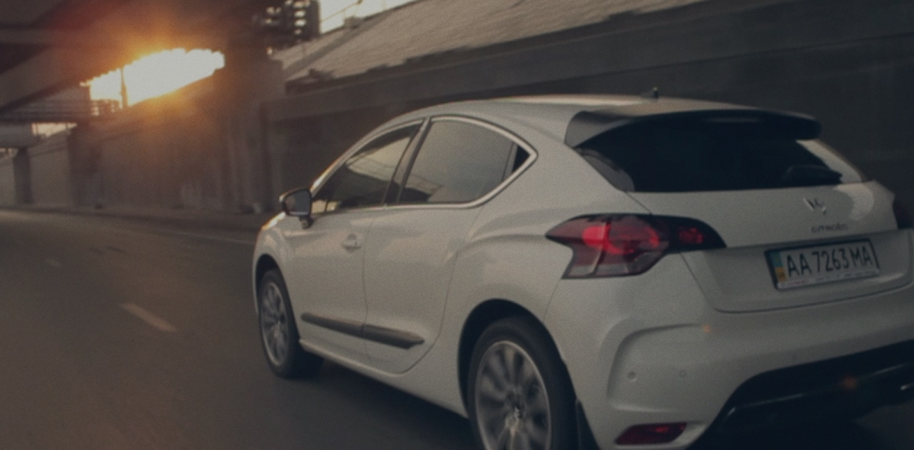
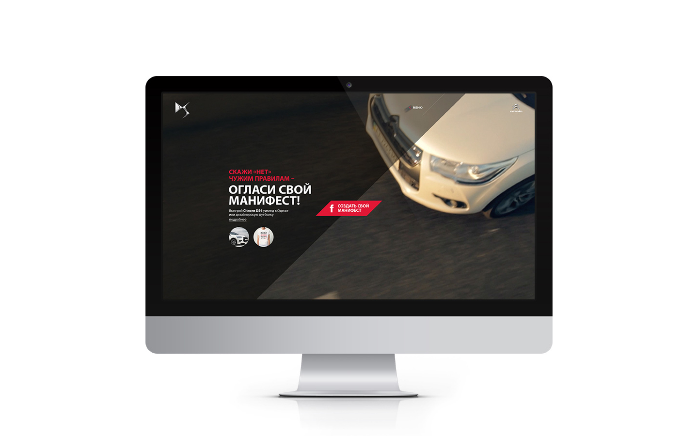
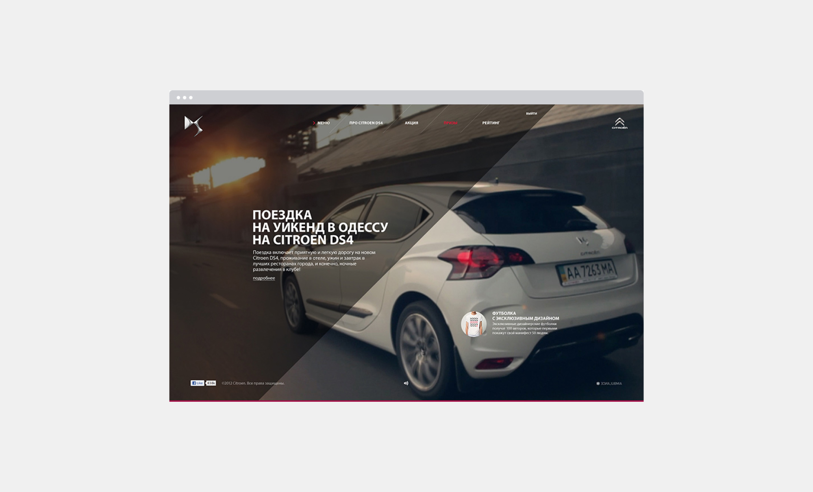
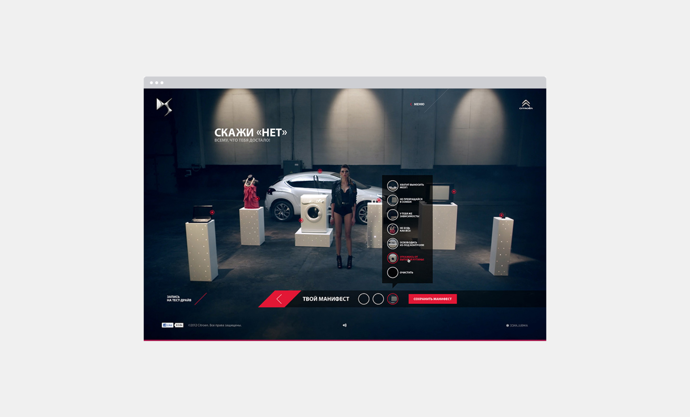
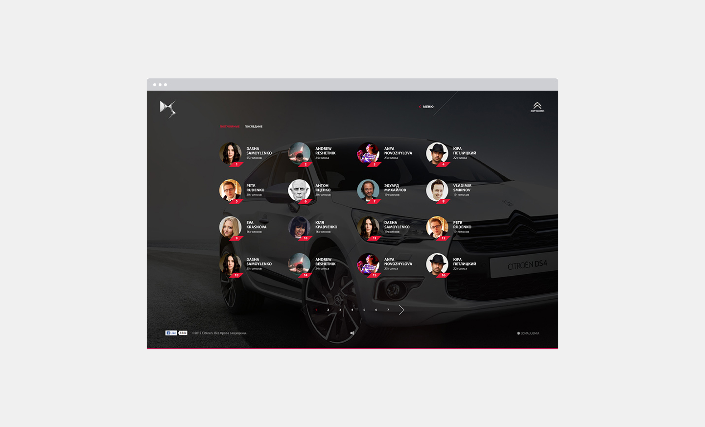
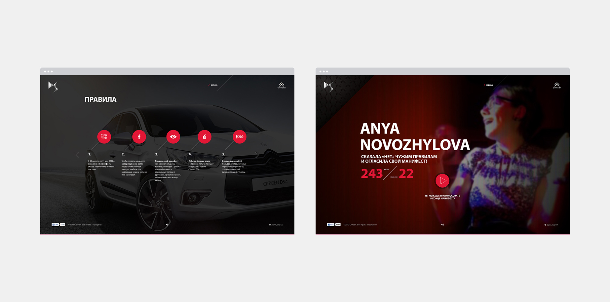
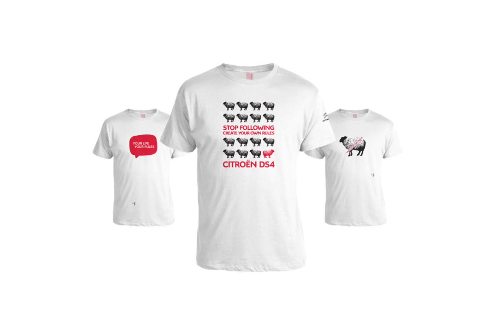

The "No-manifesto" campaign, in collaboration with Citroën DS4, aimed to provide an outlet for individuals with active lifestyles to express their opposition to various frustrations. The idea centered around creating personalized protest manifestos on the campaign's promotional website.

Upon logging in with Facebook, users could say "No!" to various annoyances, such as the pursuit of fashion or impractical household items. Each "No" led to the destruction of an object symbolizing the source of frustration. The user's manifesto was then automatically generated using their personal data, destruction footage, and a portion of the original Citroën DS4 TV commercial. This innovative approach allowed users to make a statement while engaging with the Citroën DS4 brand.

