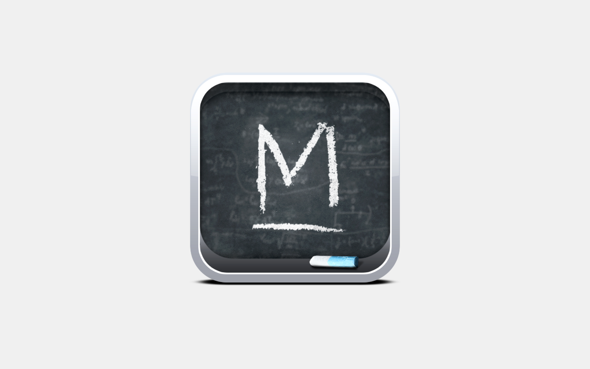
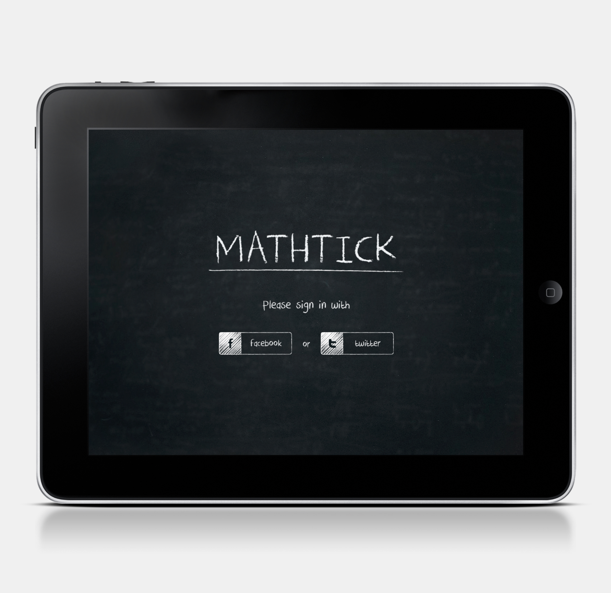
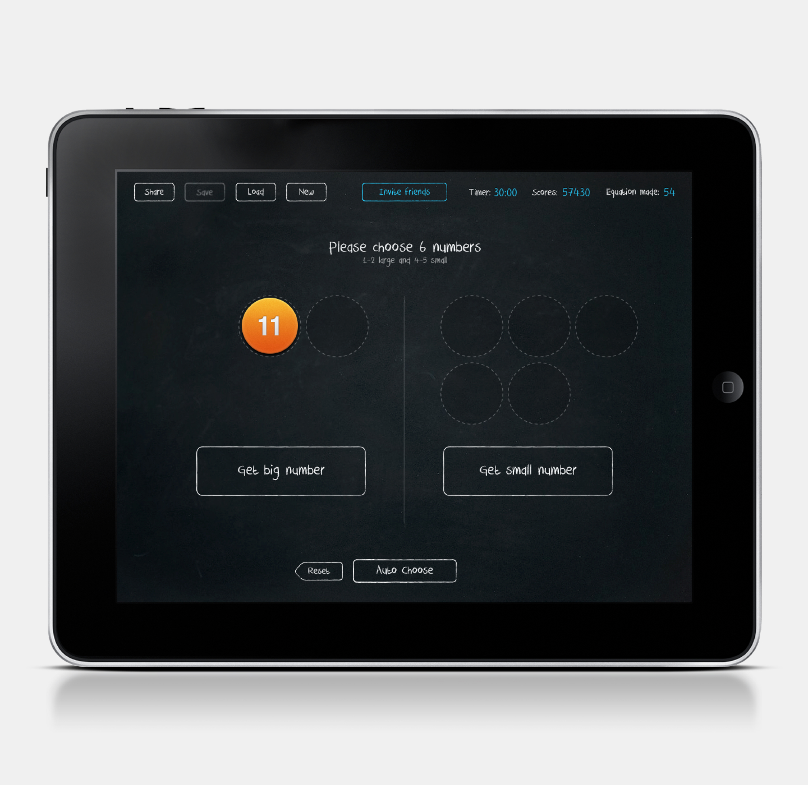
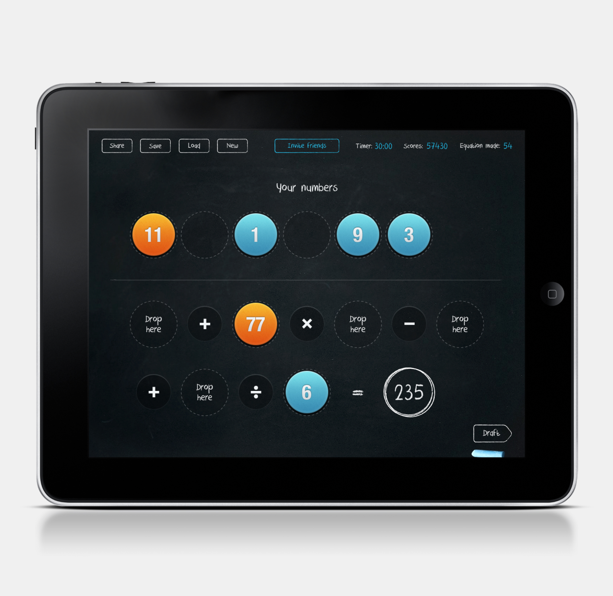
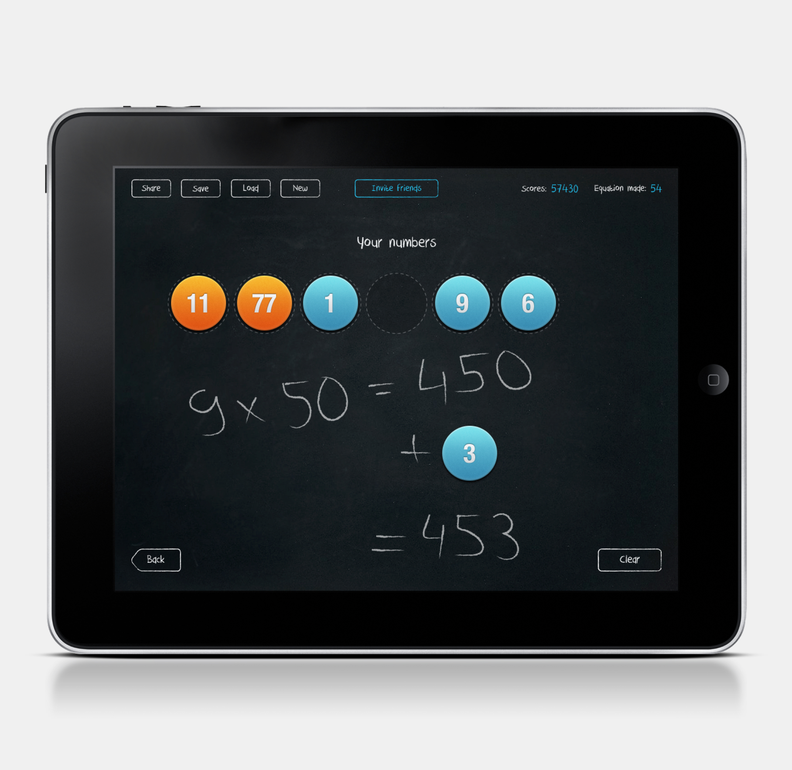

Mathtick is a math-based game designed to resemble a magnetic board, with a chalk-like font to enhance its visual appeal. The application incorporates magnetized badges representing numbers, which can be moved around the board in a logical manner. This engaging and interactive game offers a creative way to encourage learning and enjoyment of mathematics while simulating the experience of using a traditional magnetic board.

