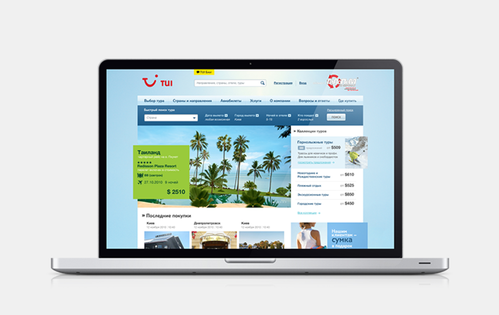
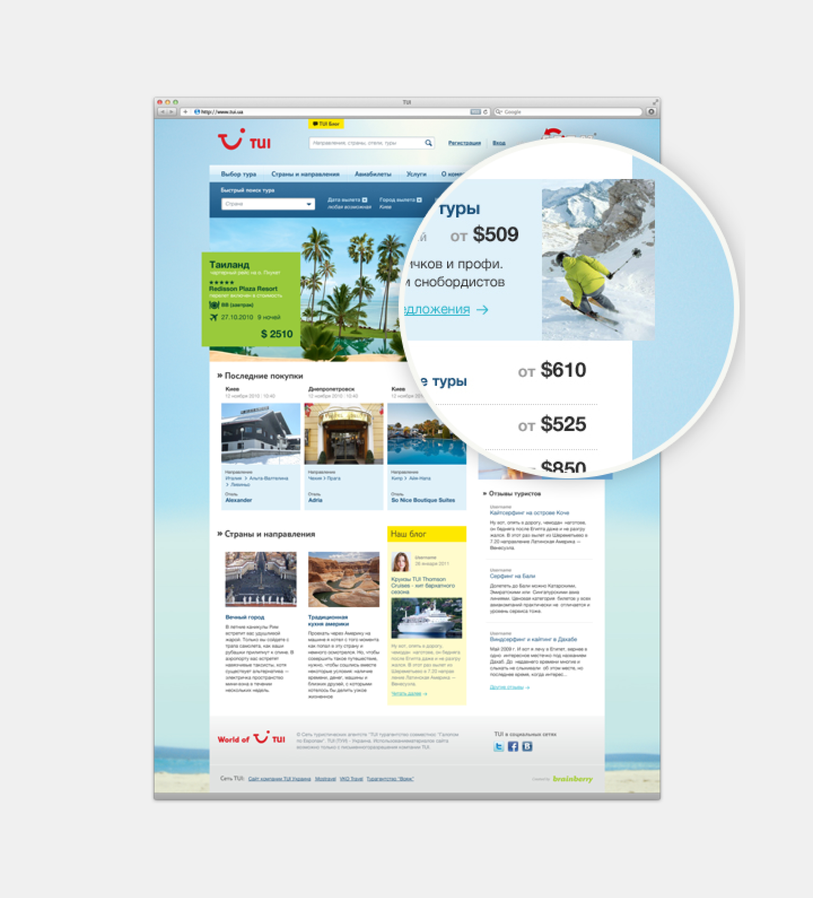
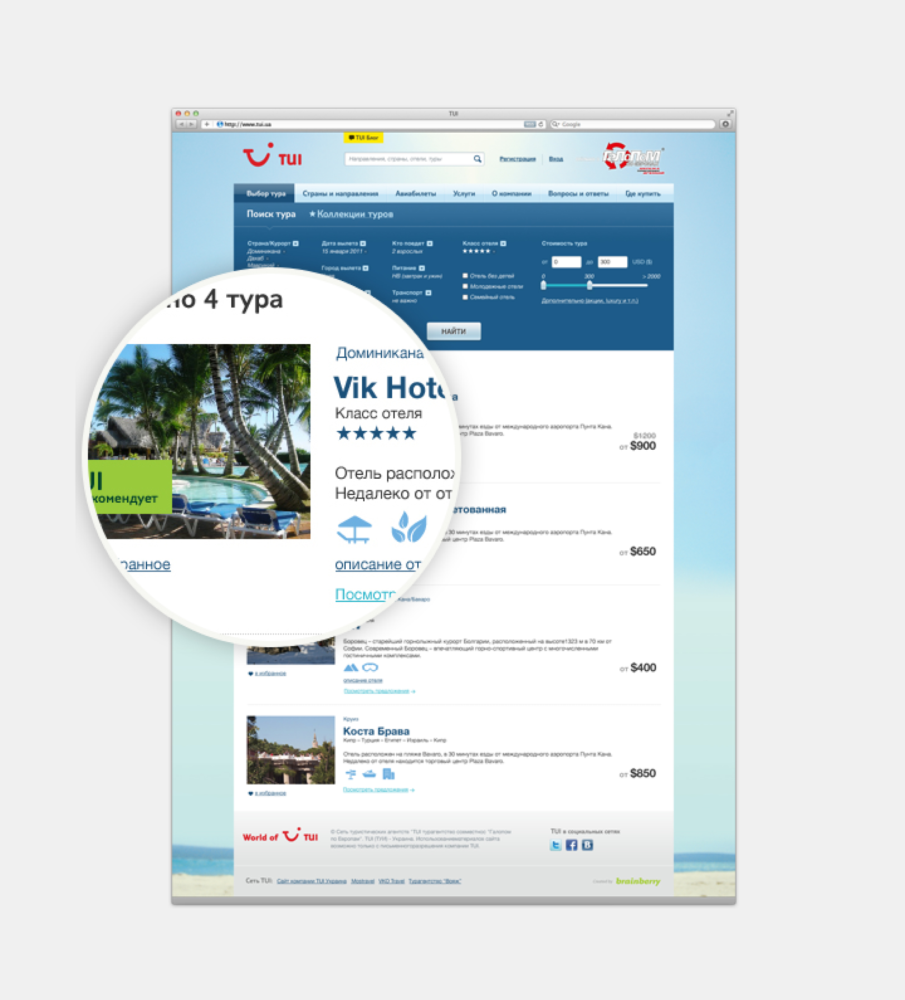
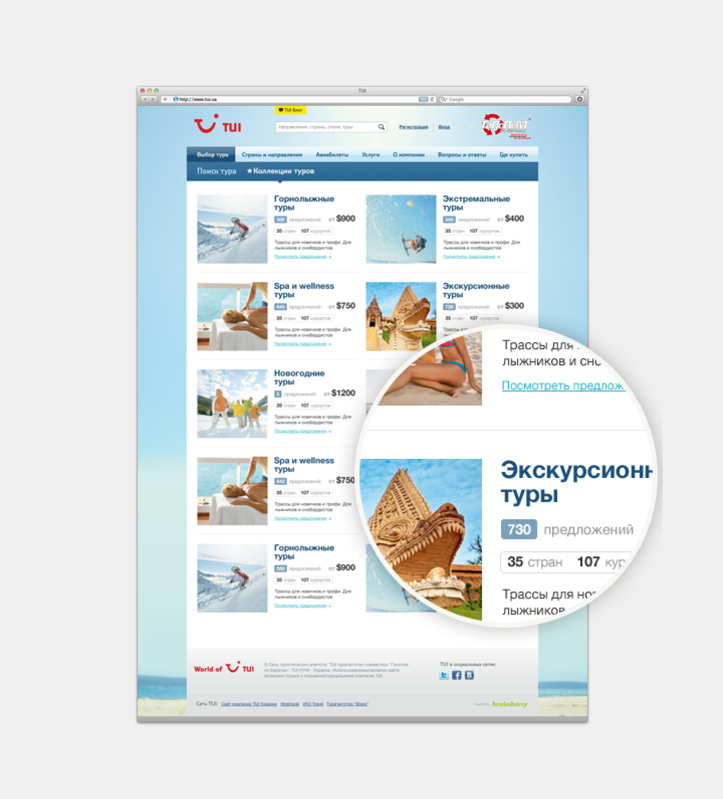
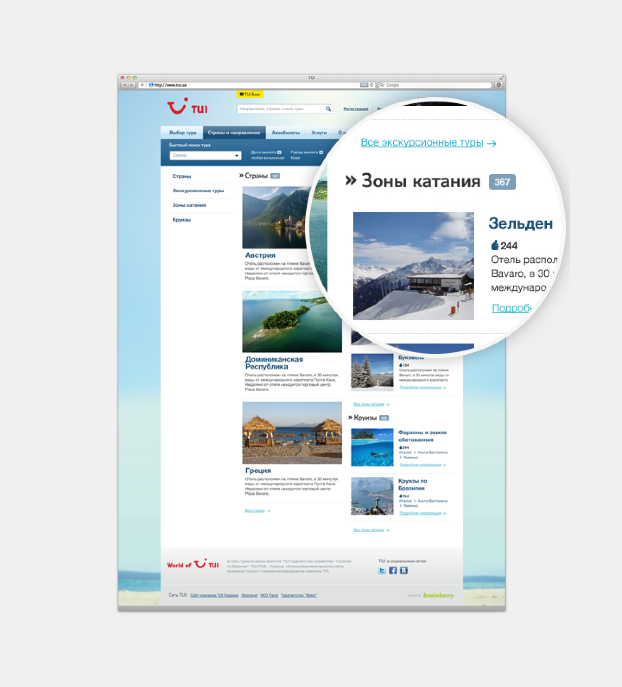
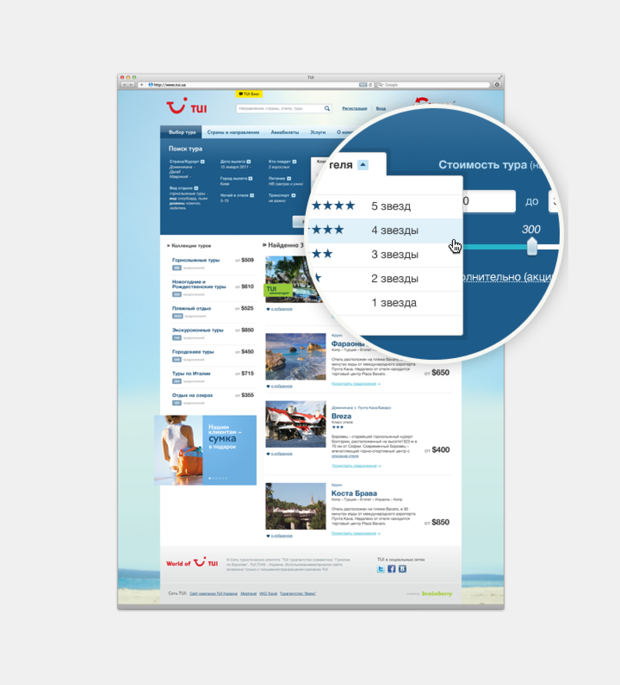
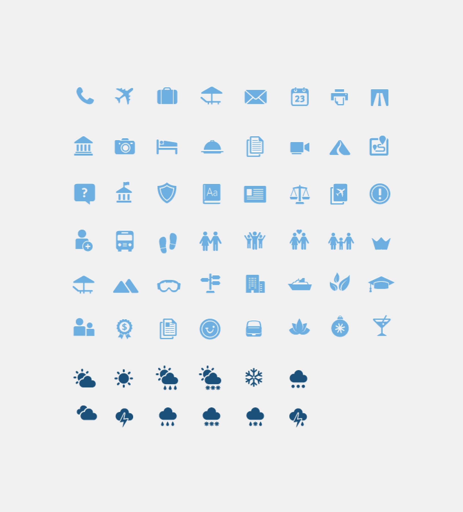

The TUI Travel Operator project involved designing a user-friendly website for the renowned travel company, TUI. The primary focus of the site was to streamline the travel booking process by offering a seamless interface for tour selection and booking. By showcasing various travel options on the main page and providing an intuitive user experience, the website aimed to make it easy for customers to explore and book their ideal tours, ensuring a positive experience with the TUI brand.

