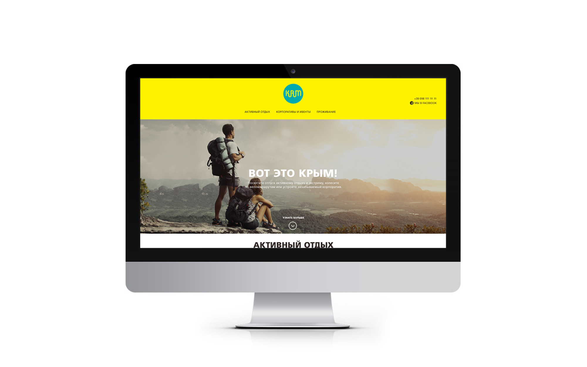
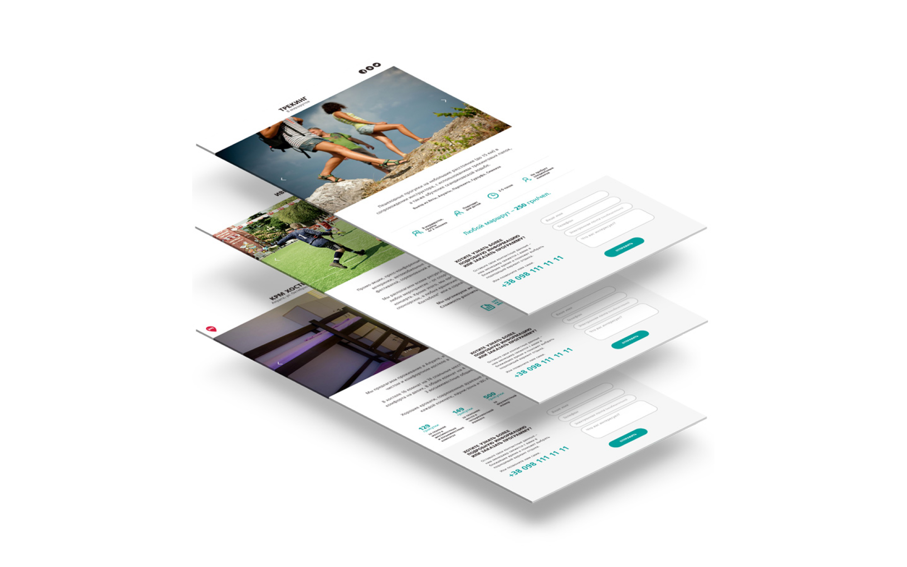

The KRM tour operator website showcases the company's specialization in outdoor activities and extreme tourism in Crimea. By bringing together expert instructors, guides, and athletes, KRM aims to provide visitors with unique, off-the-beaten-path experiences beyond the typical beach vacation.

The website presents a variety of excursion programs catered to both professional travelers and beginners, offering activities such as trekking, canyoning, rock climbing, mountaineering, zip-lining, abseiling, diving, cave exploration, and more. It also features options for various modes of transportation, like cycling, ATVs, sea kayaks, jeeps, airplanes, helicopters, gliders, steamers, and balloons, ensuring a wide range of exciting adventures for all visitors.

