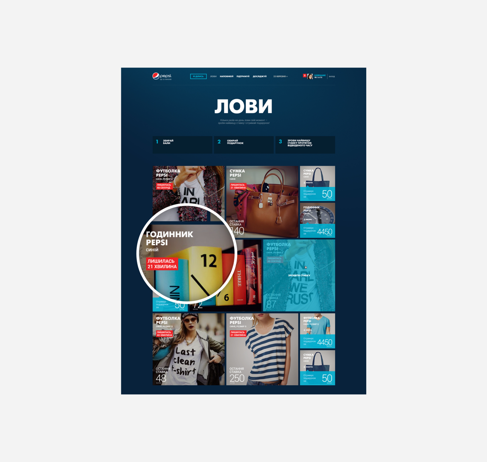

The Pepsi Moments project focused on enhancing the experiences of today's youth by providing a platform for sharing and gaining social approval. Inspired by the global idea "PEPSI. LIVE FOR NOW" the platform allowed users to capture photos, apply filters and collages, and share their moments with the community. Integrated with VKontakte and Facebook, the platform offered a seamless user experience without requiring additional registration.

The platform featured multiple sections, including Share, Catch, Support, Explore, and Fill up, offering users various ways to engage with their moments, receive stylish lifestyle gifts, and gather inspiration from others around the world. This initiative aimed to resonate with Pepsi's target audience and encourage them to cherish and share their unique experiences.

