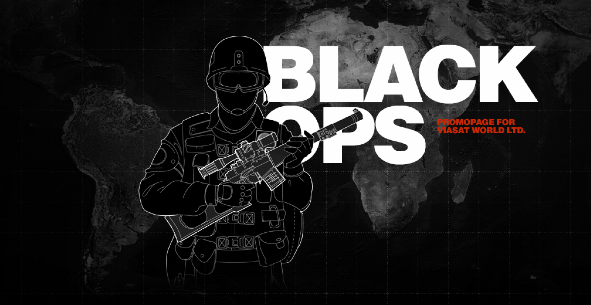
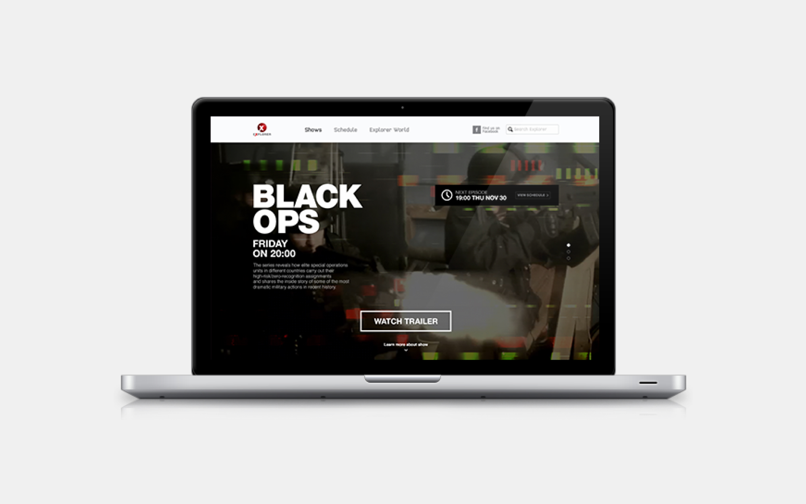
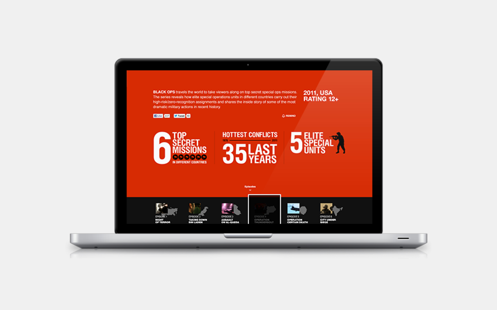
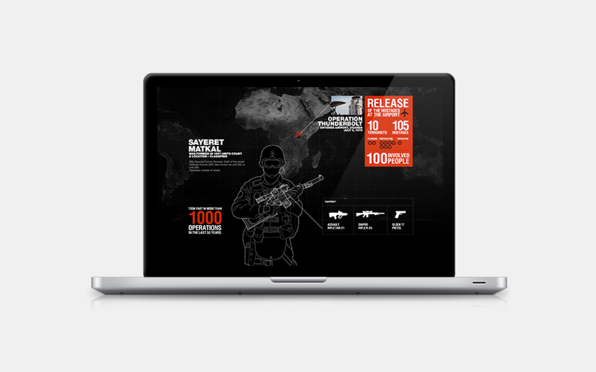
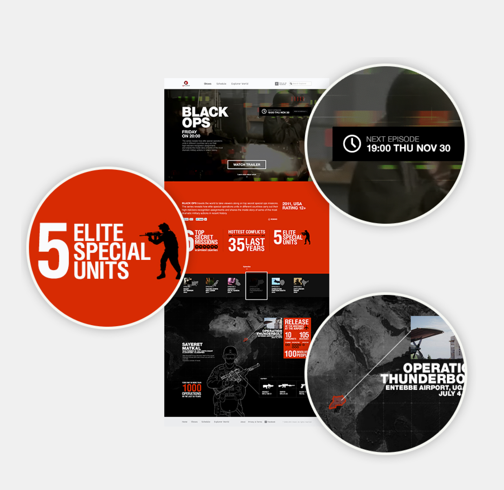
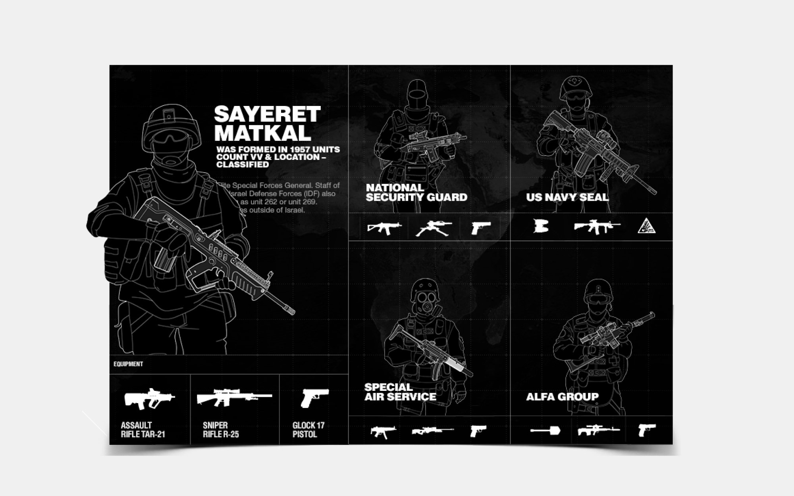
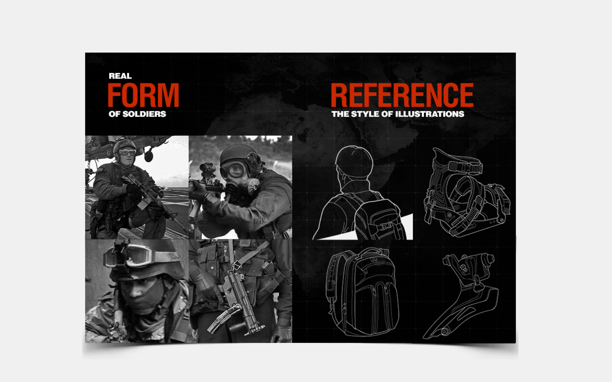

In order to promote exclusive content on channels such as Viasat Explorer, Viasat History, Viasat Nature, and Viasat TV1000, monthly promotional pages are created. These pages feature unique designs and structures based on the specific themes of the showcased programs.

A recent example includes the promotional page for Viasat Explorer's documentary series "Black Ops," which focuses on global intelligence agencies' operations. The design and structure of the promotional page were tailored to reflect the series' theme and content.

  

