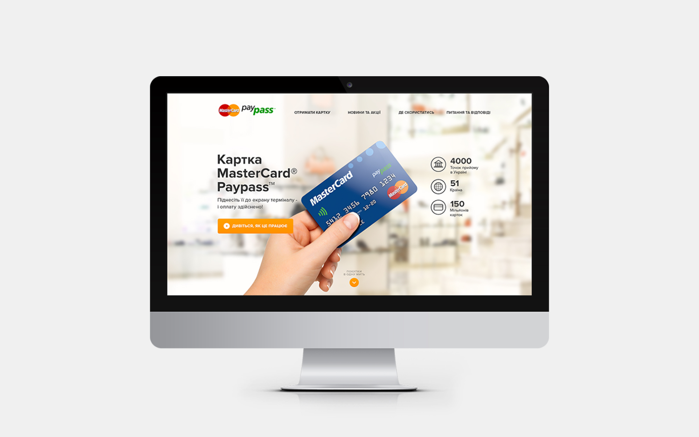
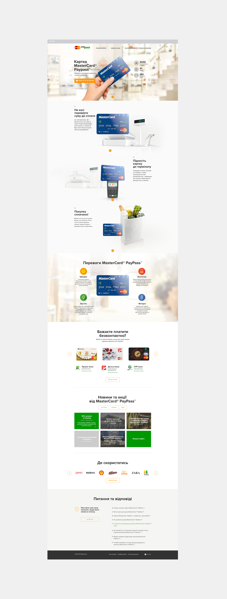

This project focused on promoting the advantages of MasterCard® PayPass™ and contactless payment technology. The created website featured various sections that provided valuable information on utilizing the card and highlighted locations where the new payment method could be employed. The project aimed to educate users on the convenience and efficiency offered by contactless payment solutions.

