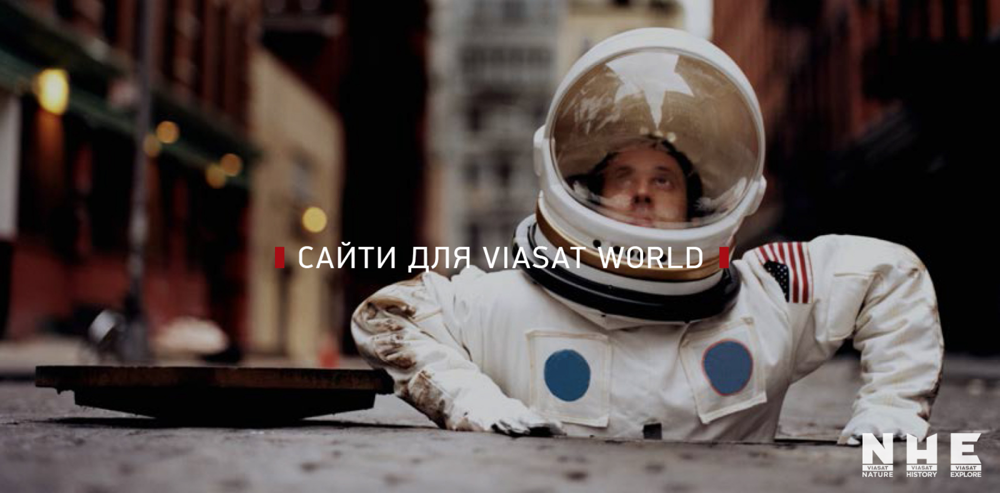
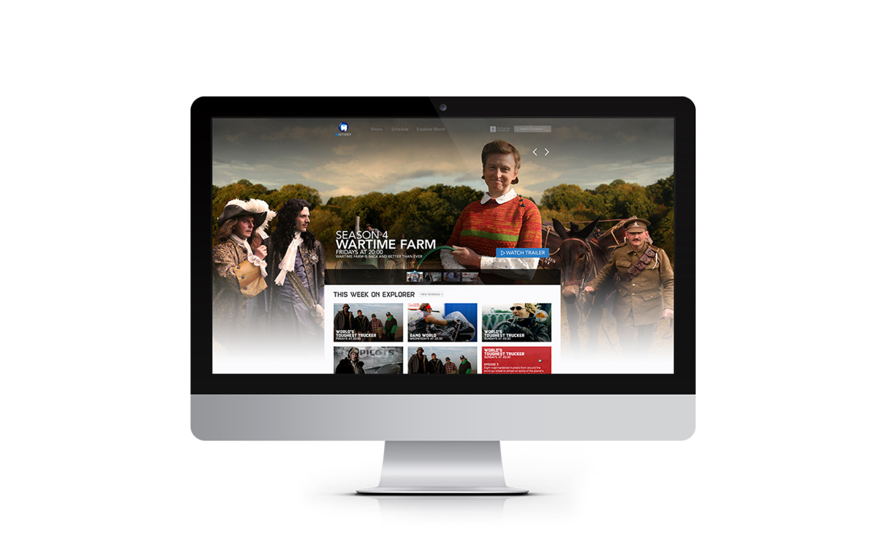
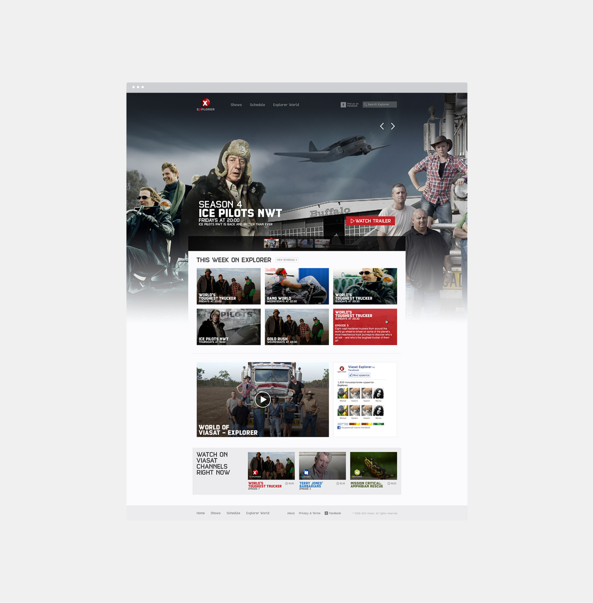
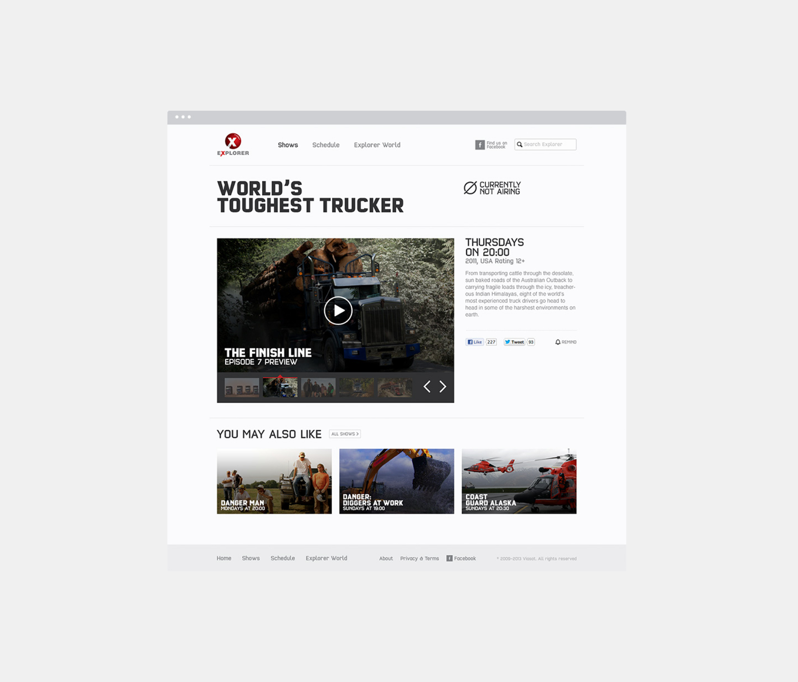
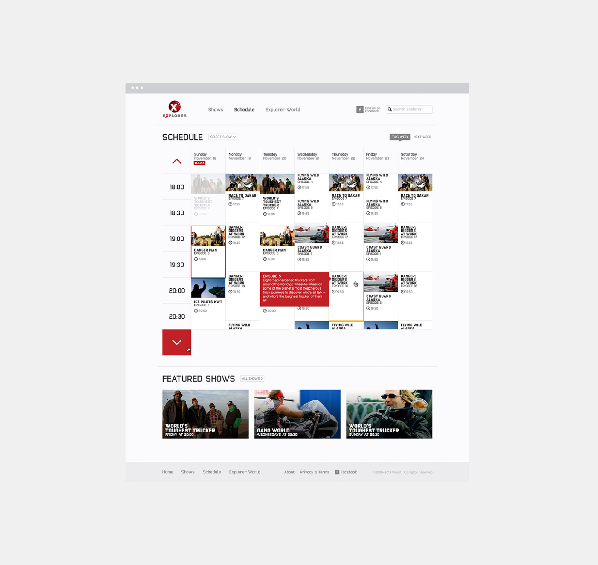
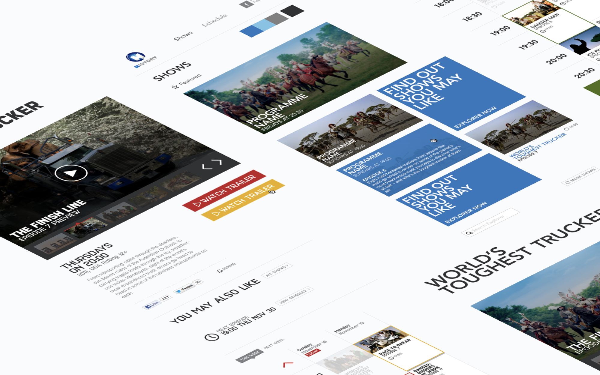
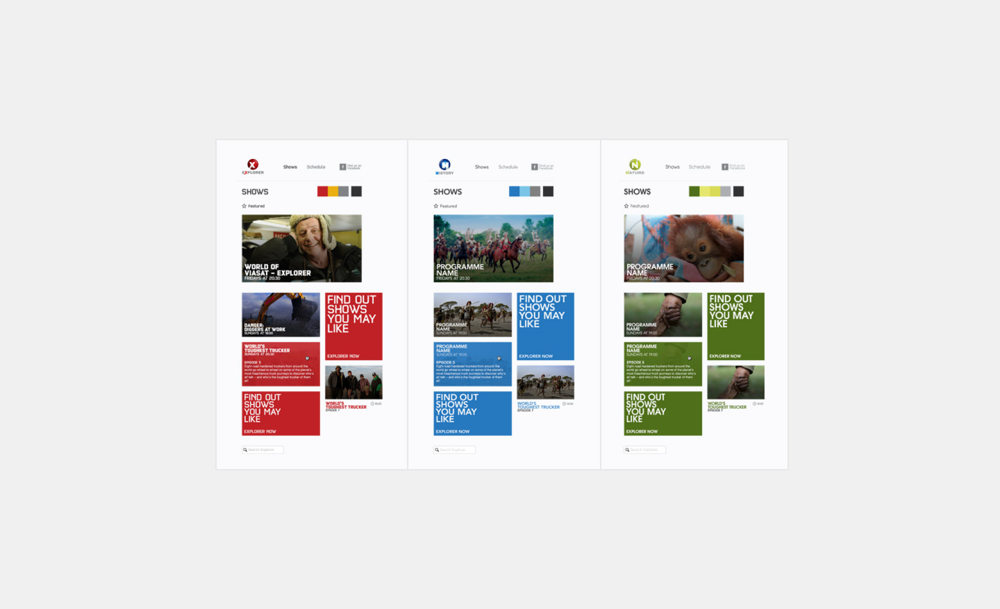
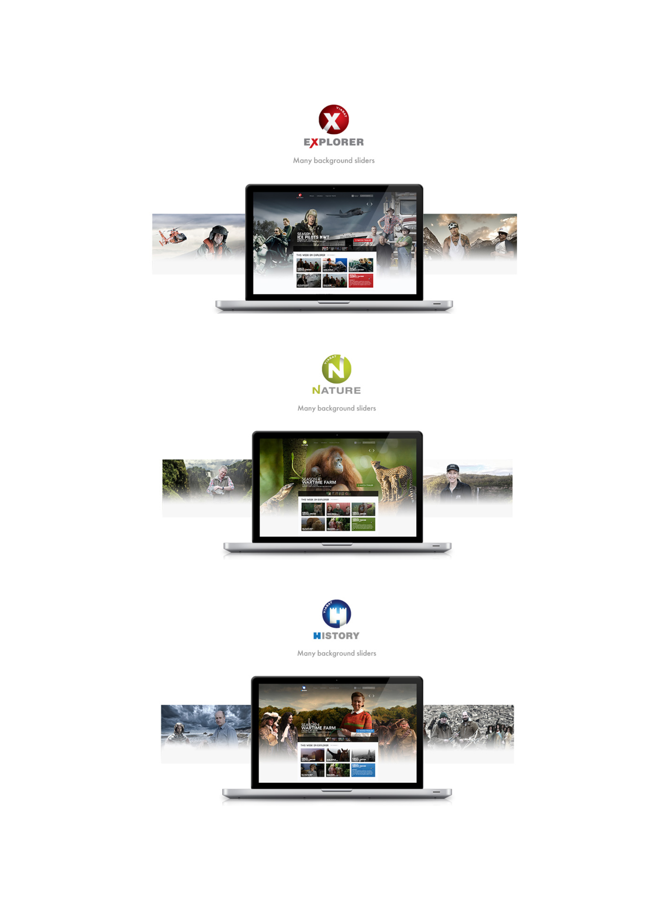

The project involved creating monthly promo pages to highlight exclusive shows on Viasat Explorer, Viasat History, Viasat Nature, and Viasat TV1000 channels. Each promo page featured unique designs and structures, tailored to the specific themes of the featured TV programs. The team successfully designed 25 websites for Viasat Broadcasting satellite channels and adapted their content to cater to audiences in seven countries: Czech Republic, Serbia, Poland, Croatia, Hungary, Romania, and Bulgaria.

