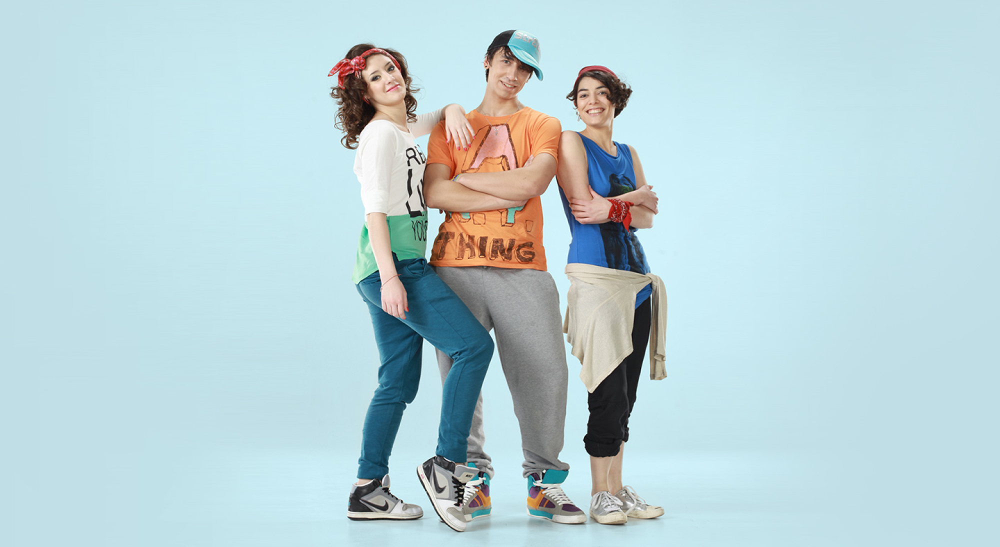
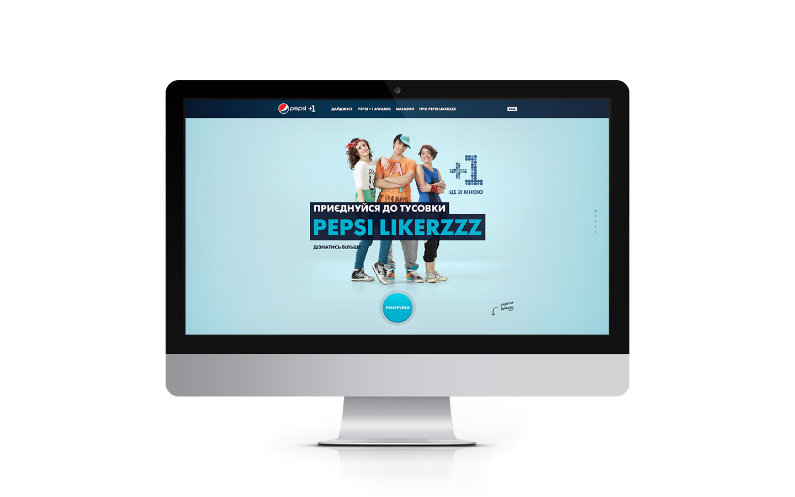
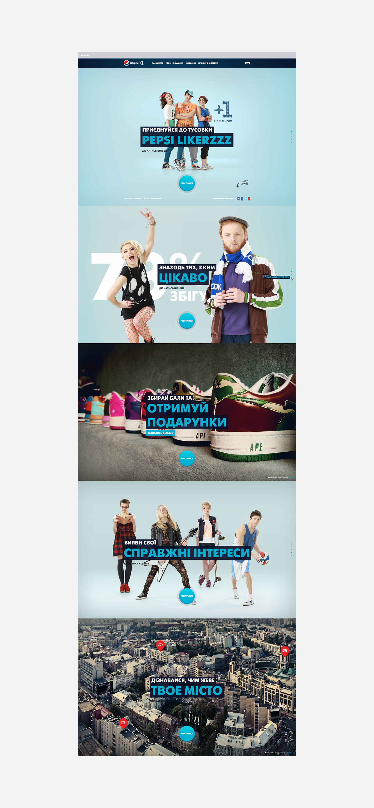
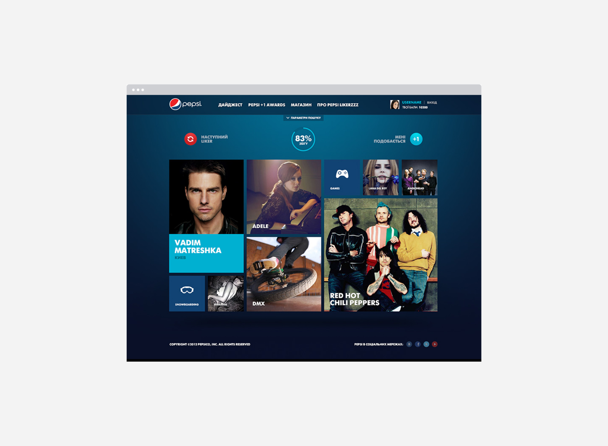
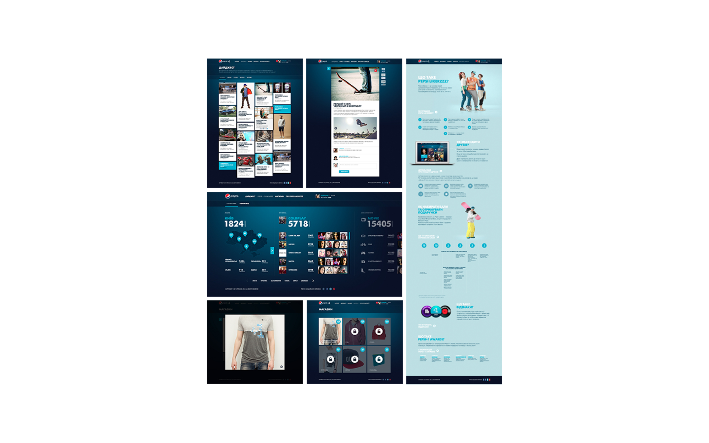
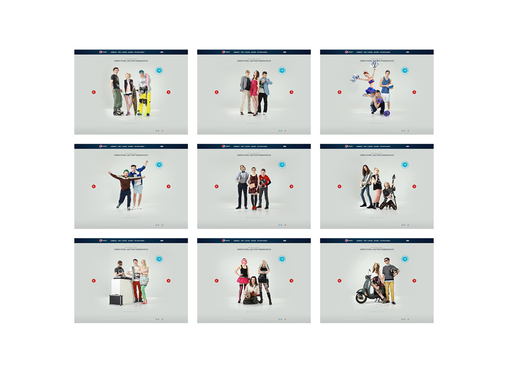
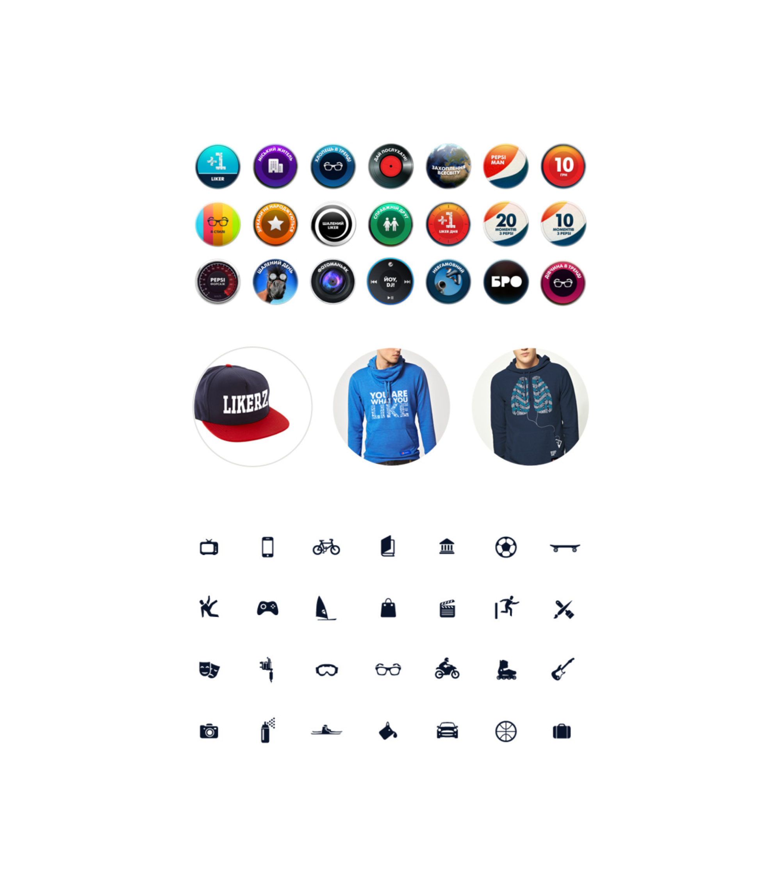

Pepsi Likerzzz is a community designed for young people with diverse interests, providing a platform to make connections, express themselves, and gain recognition for who they are. Aligned with the "I live for now" motto, this platform encourages self-expression and engagement among its users.

The core concept of Pepsi Likerzzz is enabling users to receive attention and acknowledgement by simply showcasing their interests through "likes" in various categories, such as events, music, and activities. Popular "likes" and active community members are rewarded with special badges, prizes, and points that can be redeemed for Pepsi gifts. Additionally, the platform hosts short-term activities every 2-3 months, further allowing users to demonstrate their unique personalities and earn recognition from the Pepsi brand.

### Award
EFFIE Silver 2012

