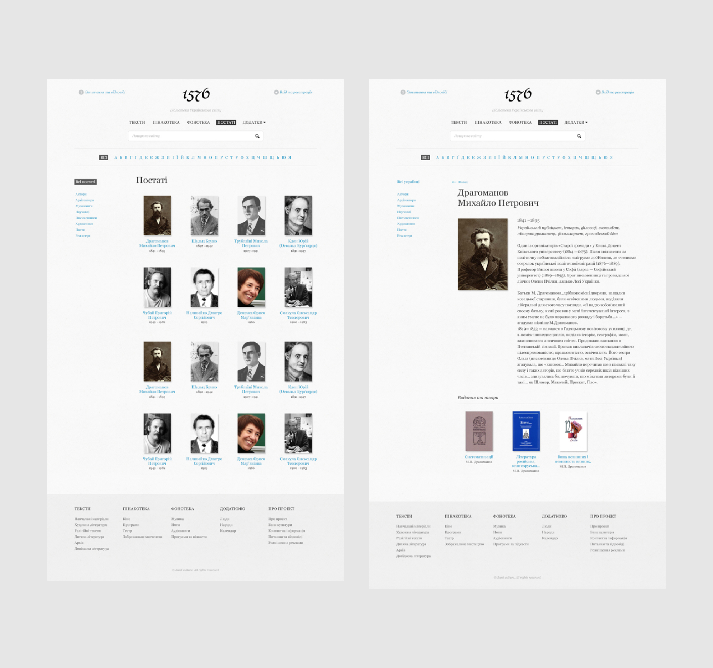
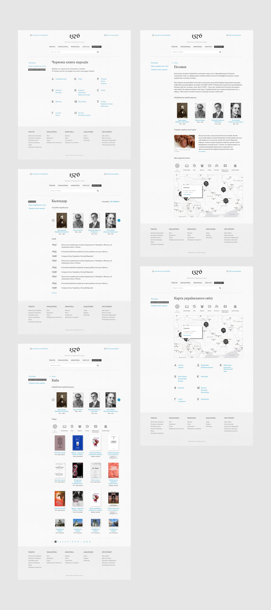
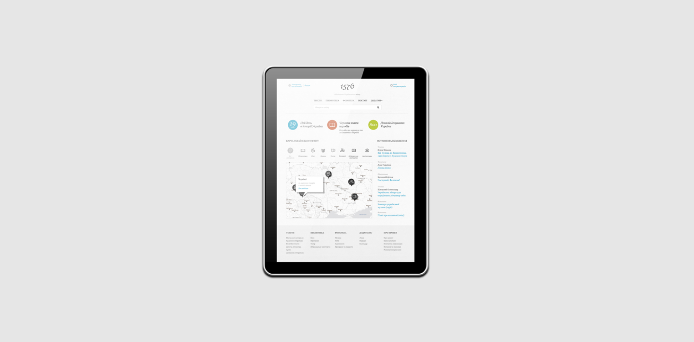

The first structured public library Ukrainian world, the reader and the compiler which can be any! 1576.ua allow everyone interested to hear, listen and see characters Ukrainian classics, to feel the depth of personalities, most of which are known to us only by the so-called "summit achievements." We want to restore the rich and ambiguous world of Ukrainian culture in the diversity of languages, sounds and colors.

Main page

Icons set

Inner pages

Elements

