

The Pepsi Retro project provided online support for a campaign celebrating Pepsi's anniversary in Ukraine and the introduction of Pepsi Retro. The goal was to engage modern teenagers with the culture of the 1980s and evoke nostalgia in older audiences through the Pepsi-Cola Time Machine.

The campaign leveraged the previously implemented Pepsi Likerzzz platform, which already had 140,396 users. The platform was redesigned, and user profiles were analyzed to switch their modern interests and music preferences to those of the 80s. A timeline showcased important events and trends from 1978 to 1991, with each year featuring five iconic items representing fashion and developments of the time.

The campaign also included a transformation stage, where participants could immerse themselves in the 80s era using a Photo Atelier and the "Chum Outfit" to create images with period-appropriate hairstyles and gadgets. This interactive experience allowed users to connect with the past and celebrate Pepsi's history in a unique and engaging way.

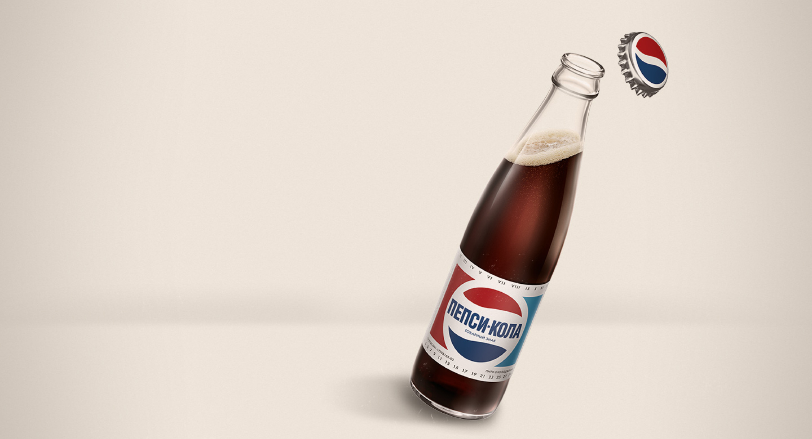

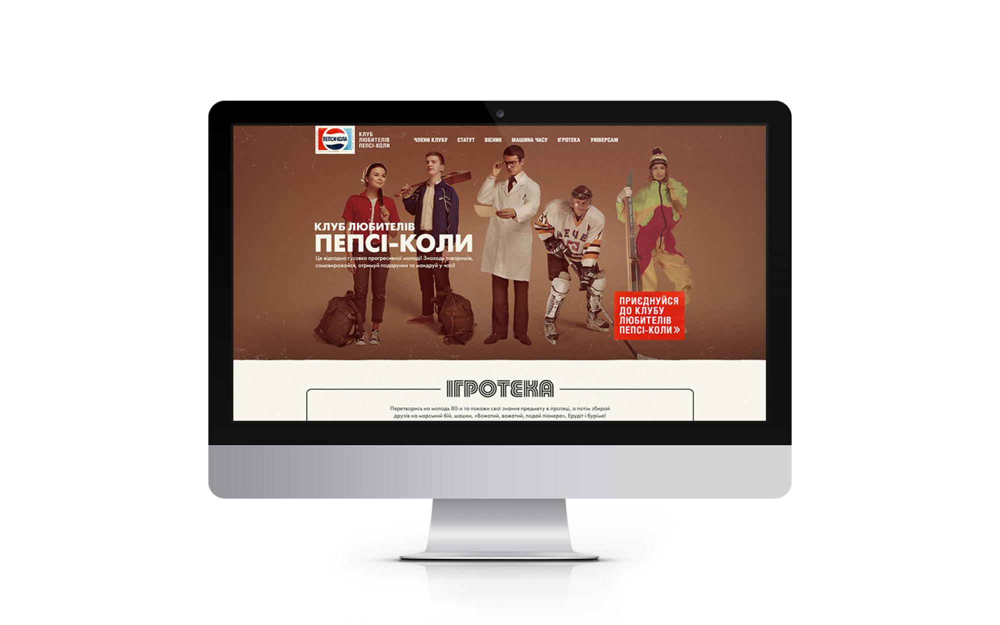

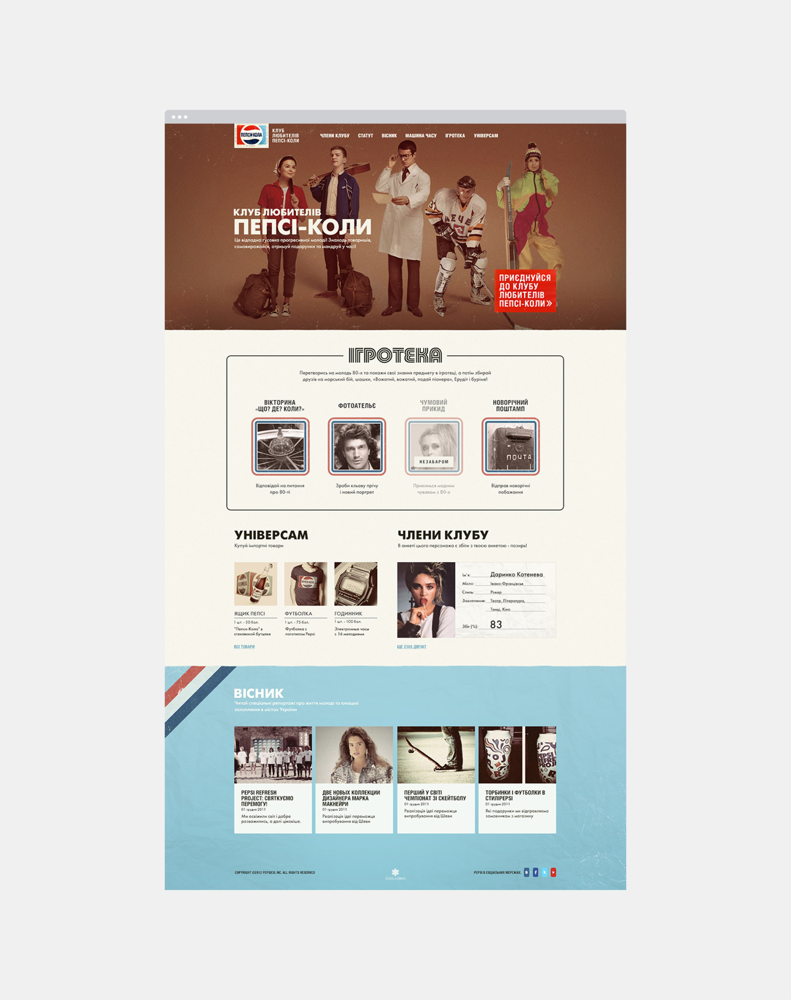

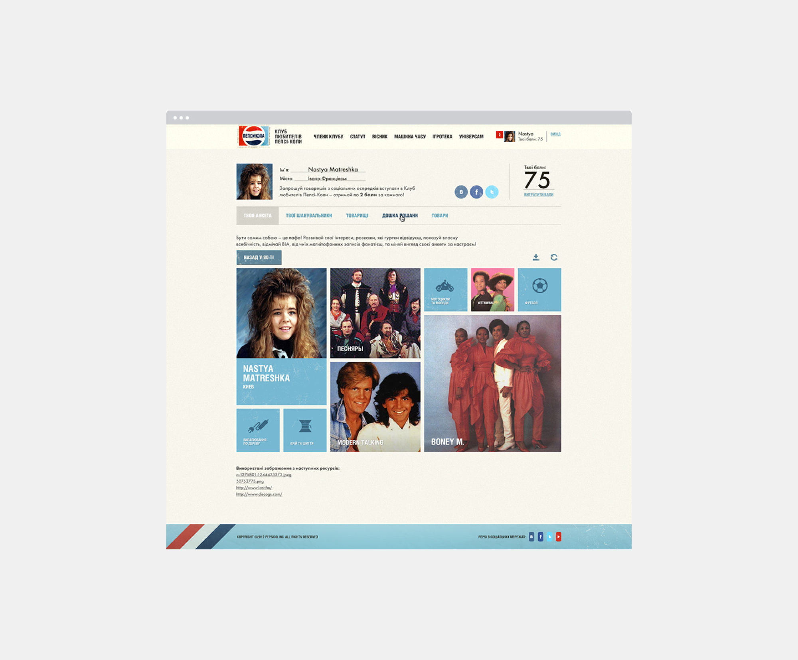

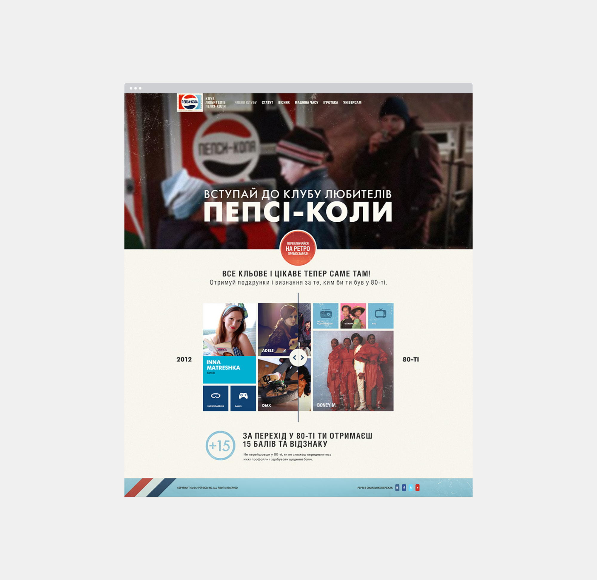

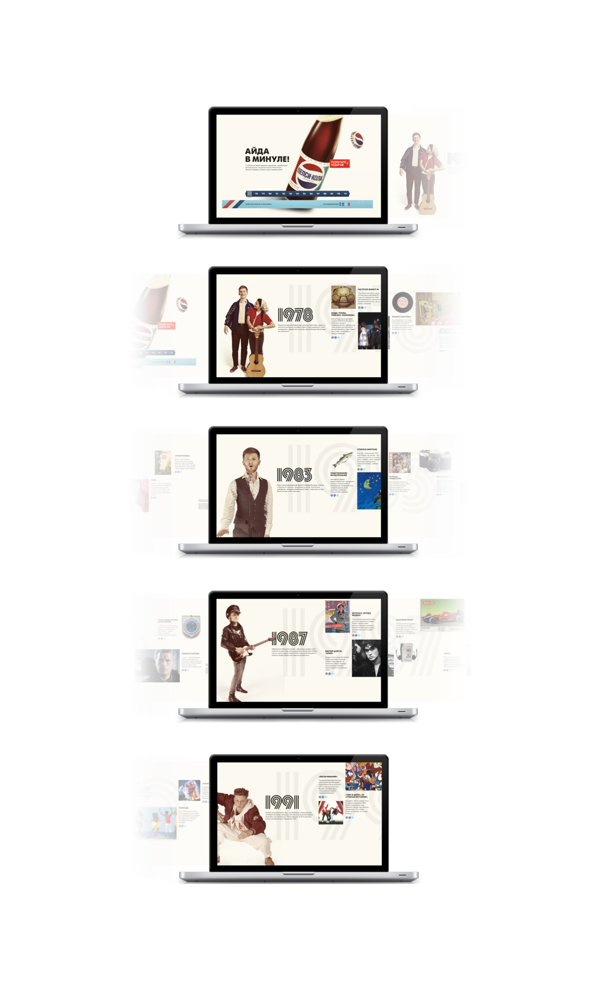

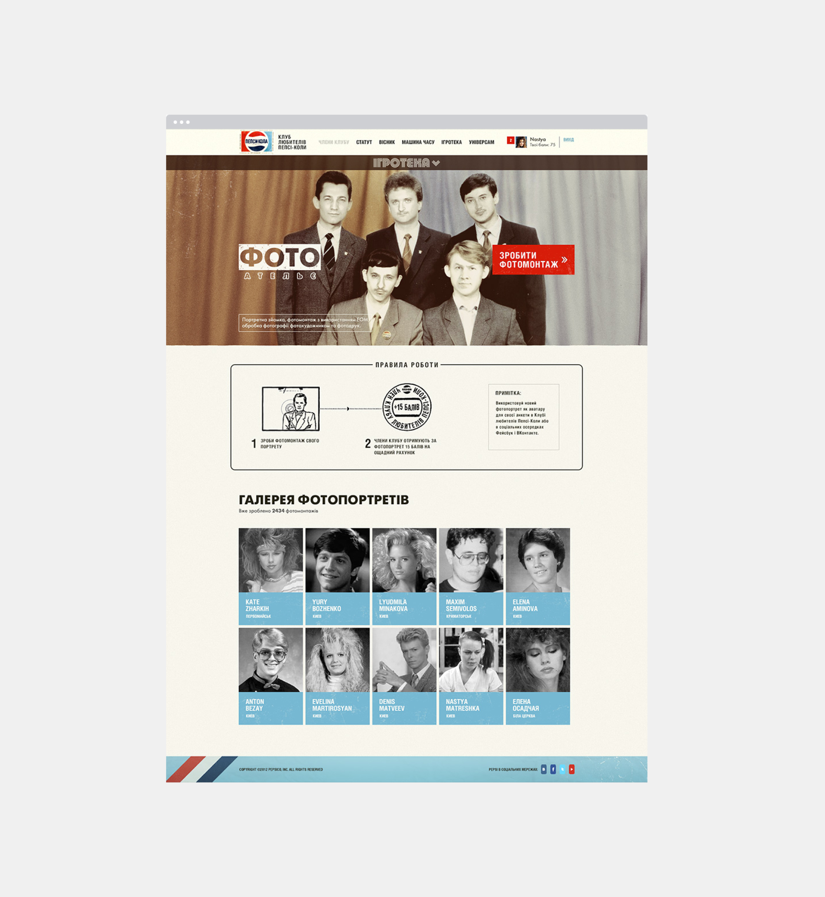

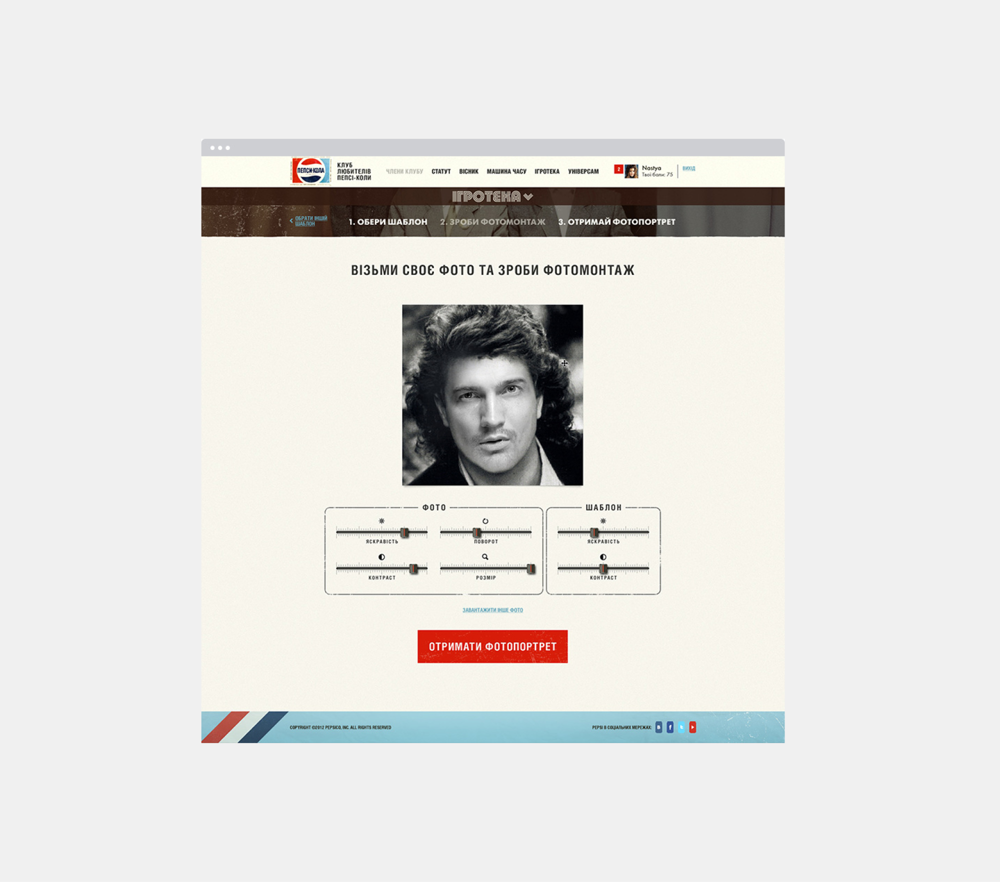

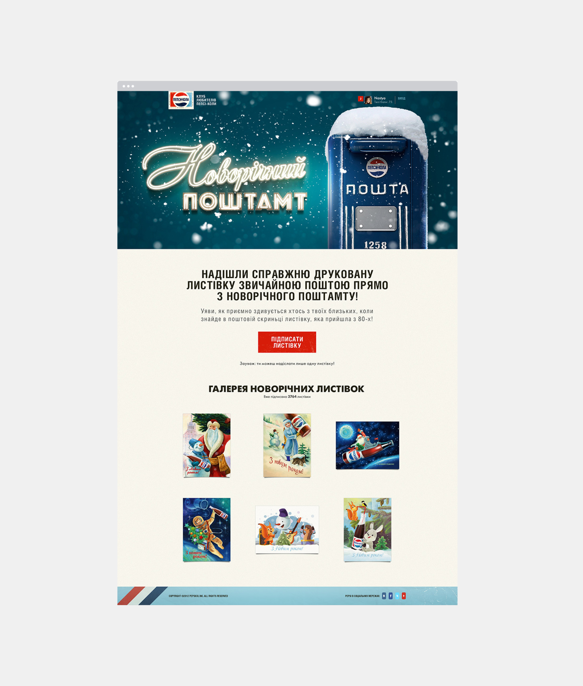

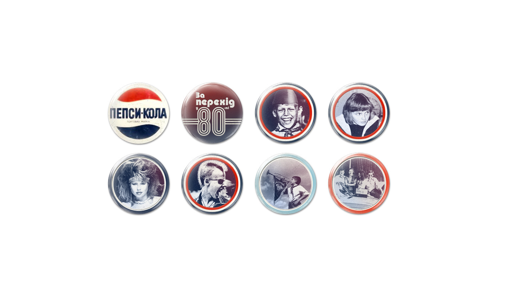

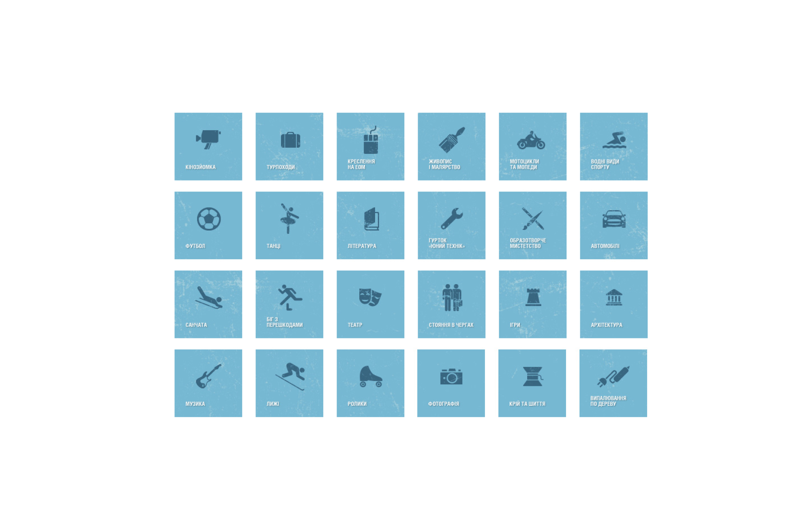

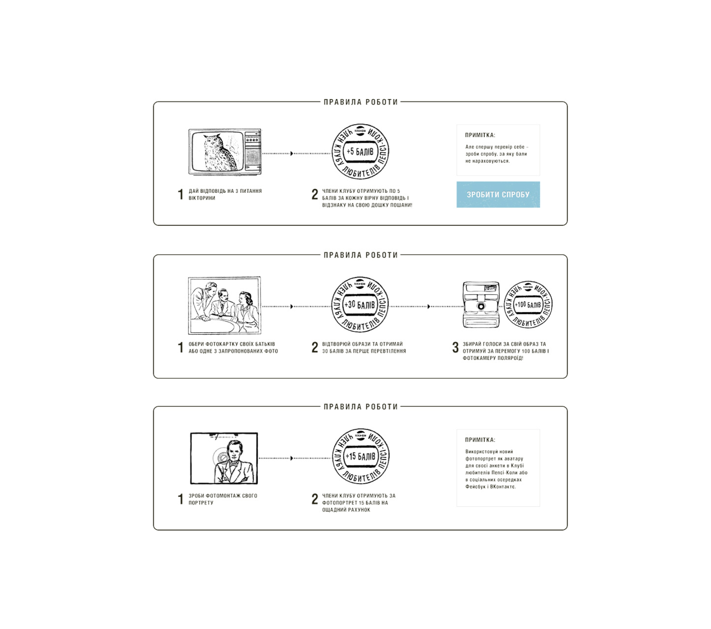

### Awards
- Propeller Gold 2013
- Red Apple Silver 2013