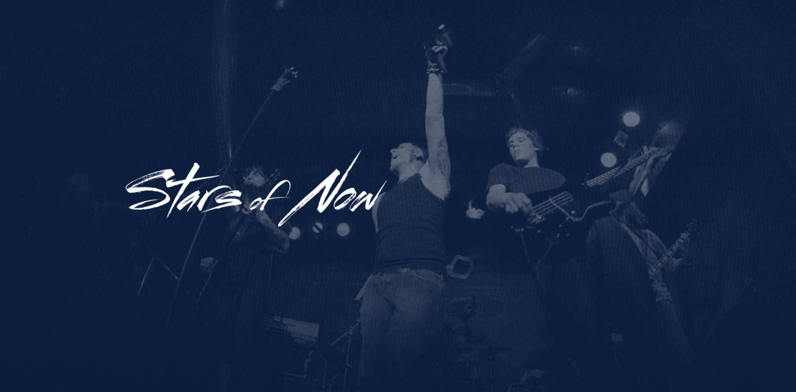
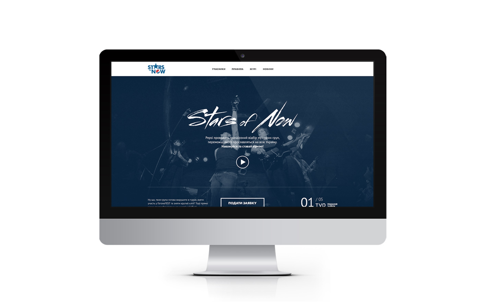
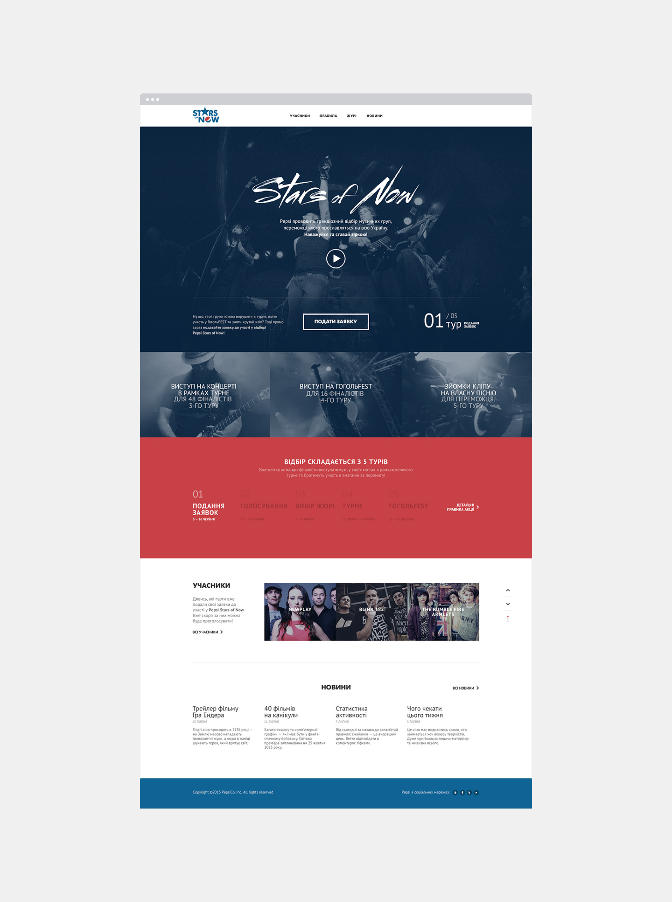
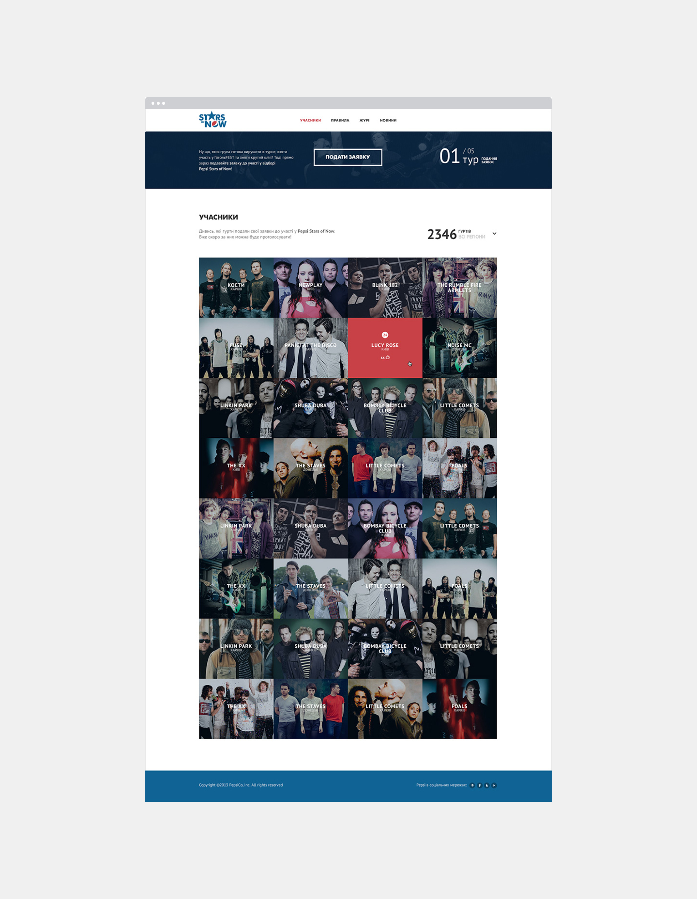
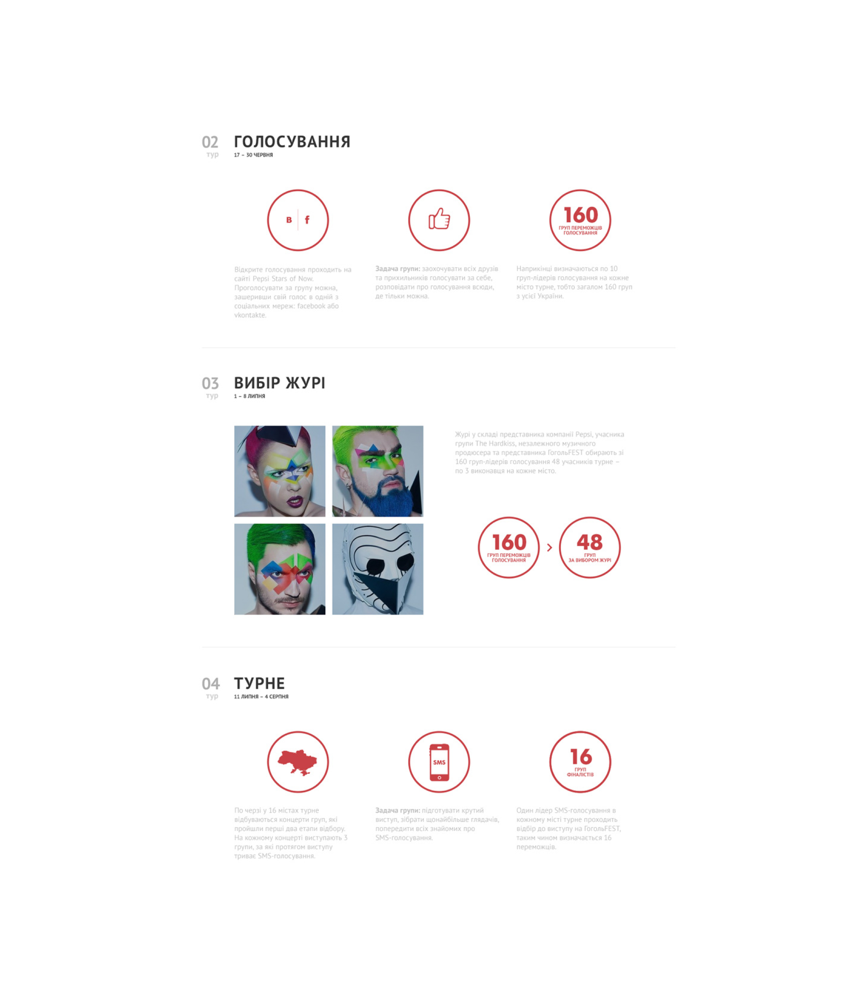

The Pepsi Stars of Now project aimed to support young musicians in their pursuit of fame and recognition. A platform was developed to enable aspiring bands to showcase their talent by creating personalized pages and uploading up to three tracks. This initiative provided emerging artists with an opportunity to gain exposure and connect with their first fans. The winning band was awarded a professionally produced music video and airplay on Europa Plus Ukraine radio, offering a significant boost to their budding career.

### Awards
KIAF Bronze 2014
