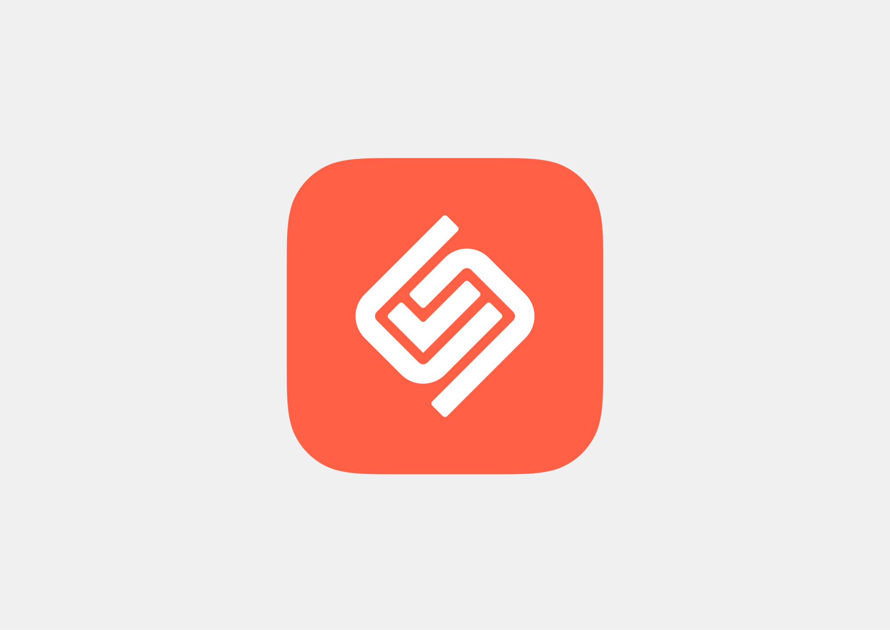
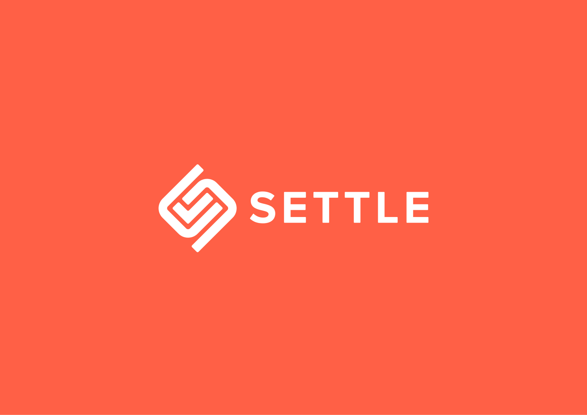
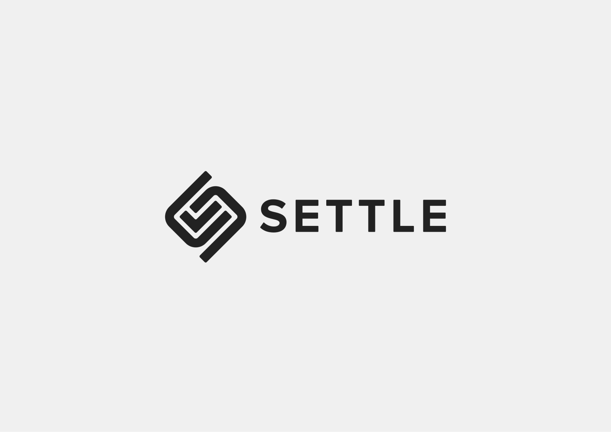
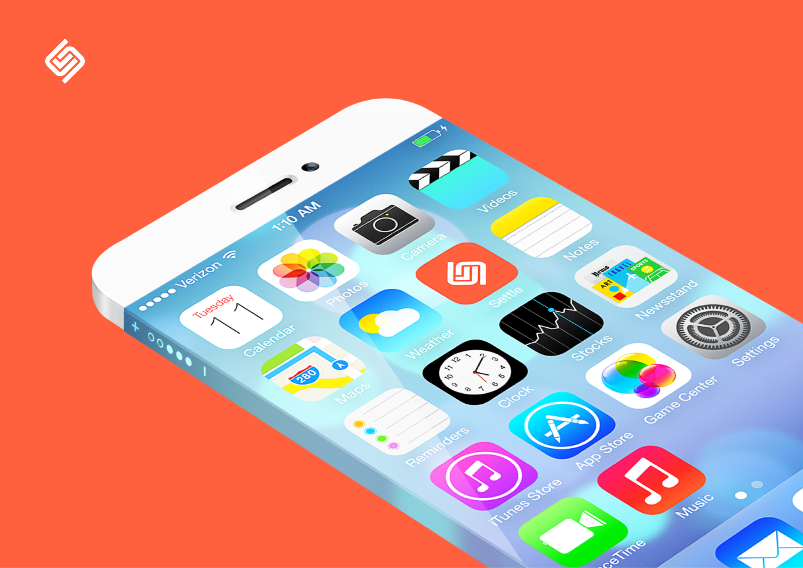
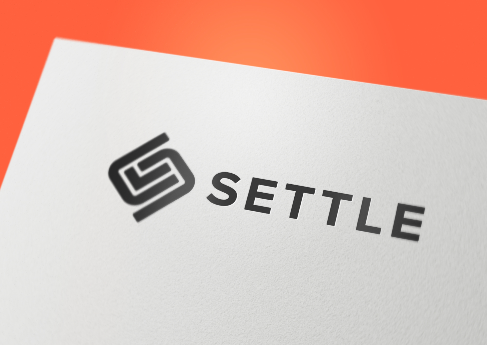
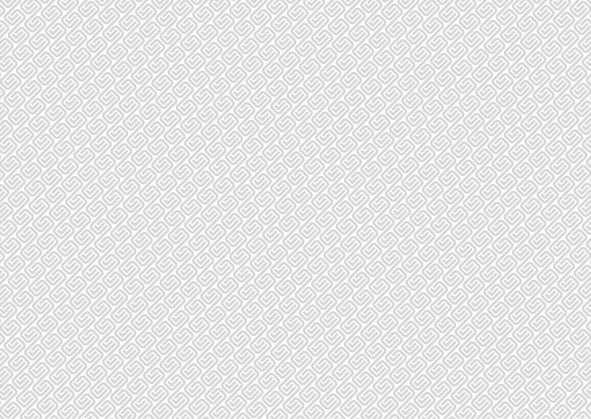
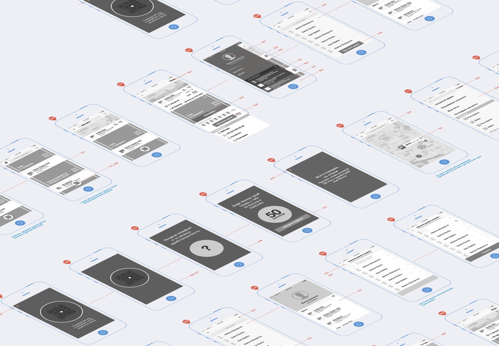

Settle is an app and web-site that allows users to pre-order food and dine at restaurants without waiting. My role in the project was to work on the user experience (UX) design, visual design and logo design. I designed the user interface and user flow, making sure that the app is intuitive and easy to use. I also created a visually appealing and consistent design using modern design elements, typography and color schemes. The logo is simple and memorable, easily recognizable and represents the app's mission. The app and web-site is designed to make the process of ordering food and dining at restaurants more efficient and enjoyable for users.

