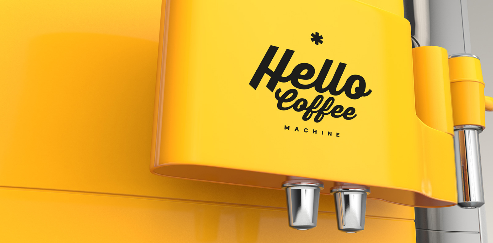
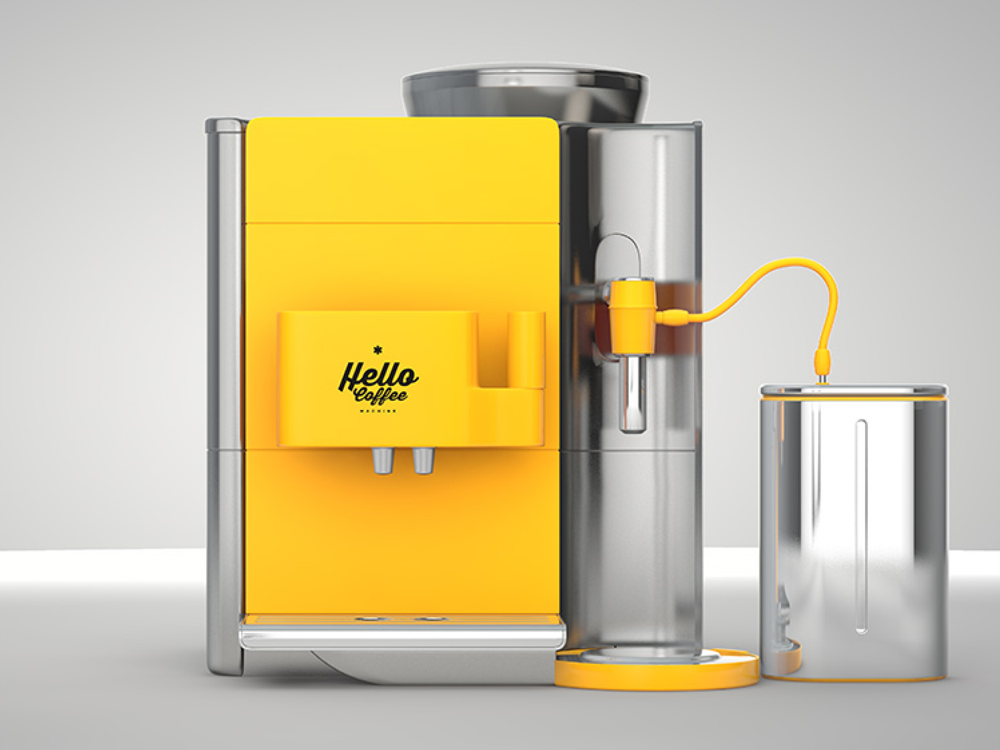
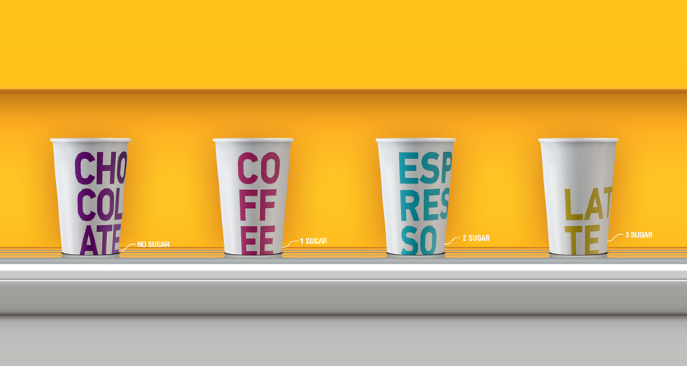
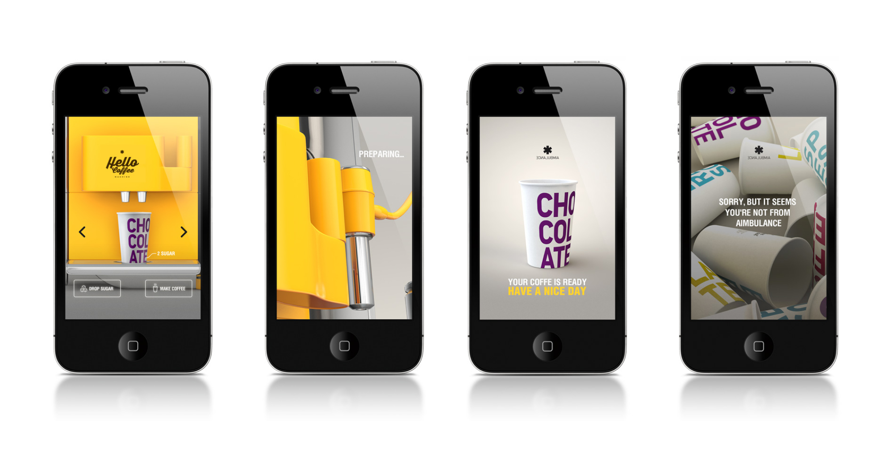
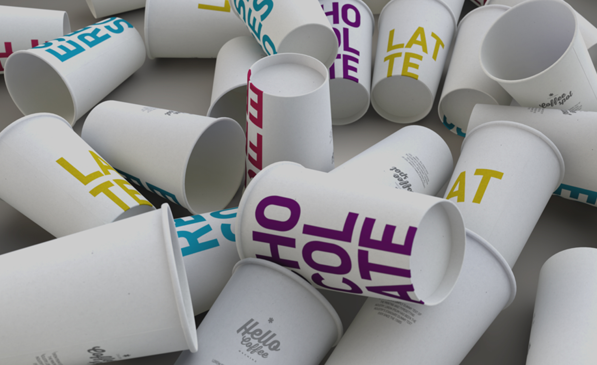

The project at Aimbulance aimed to streamline morning routines by combining the coffee consumption and check-in processes. A phygital coffee machine was developed, which allowed employees to order their coffee and automatically check in via their mobile phones. By visiting the coffee machine's page, employees could easily start their day with a hot cup of coffee and a hassle-free check-in experience.

  

### Awards
- Ukrainian Design The Very Best Of 2014
- Kakadu Silver 2014