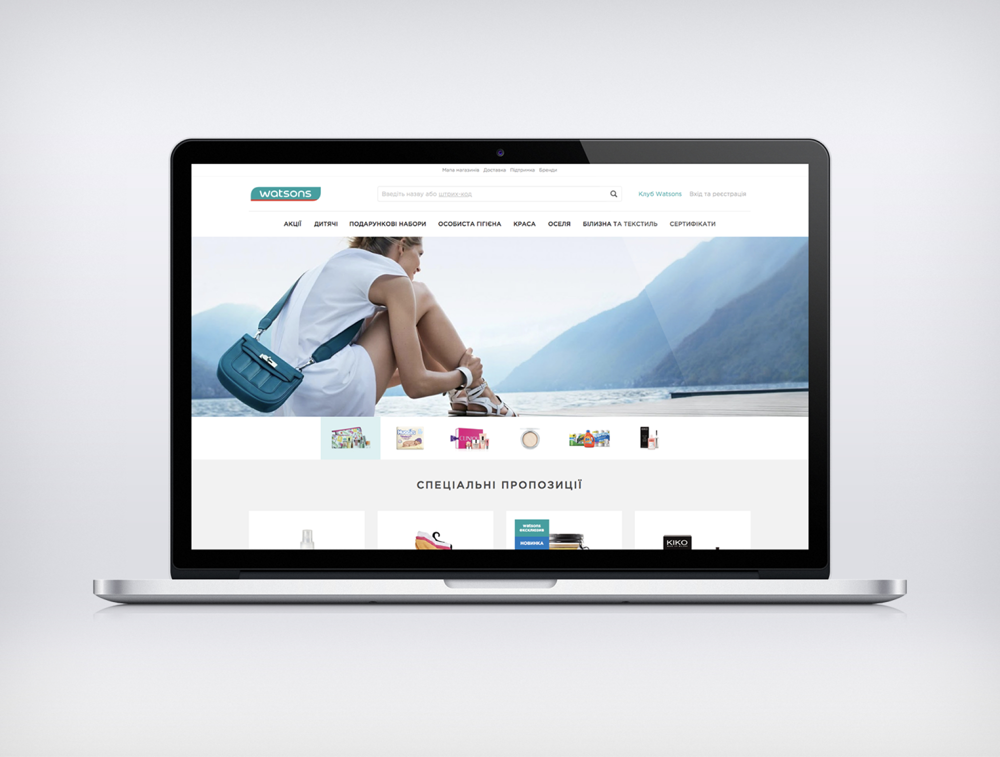
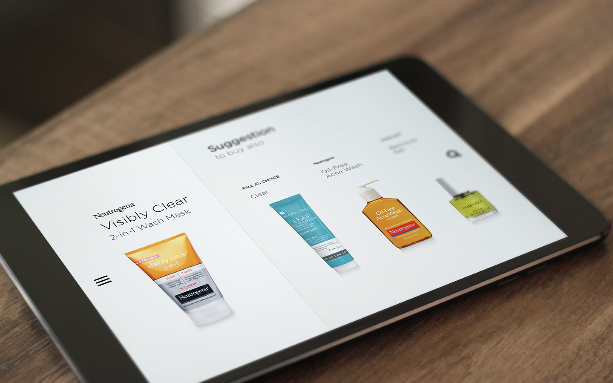
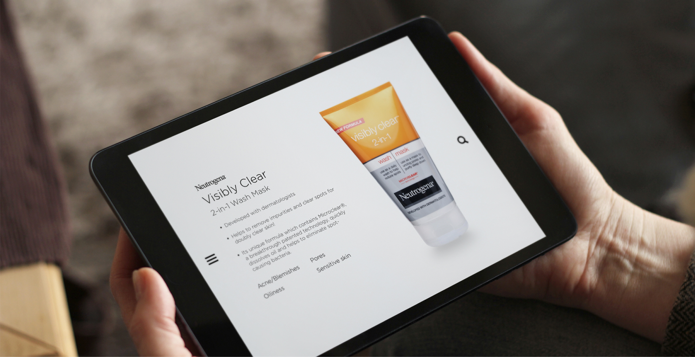

The Watsons shop web-site is an e-commerce platform for Watsons, a leading health and beauty retail chain. The site allows customers to browse and purchase a wide range of health, beauty, and personal care products from Watsons, including skincare, makeup, vitamins, and more. 

The site features a user-friendly interface, easy navigation, and a variety of tools to help customers find the products they need, such as product filters, search bar and product recommendations. 

The website also includes the feature of creating an account, tracking order status, and online payment options. The site is designed to provide a seamless and convenient shopping experience for customers who want to shop for Watsons products online.

Watsons training app is a project that was designed for the in-house training and development of the employees of Watsons, a leading health and beauty retail chain. 

