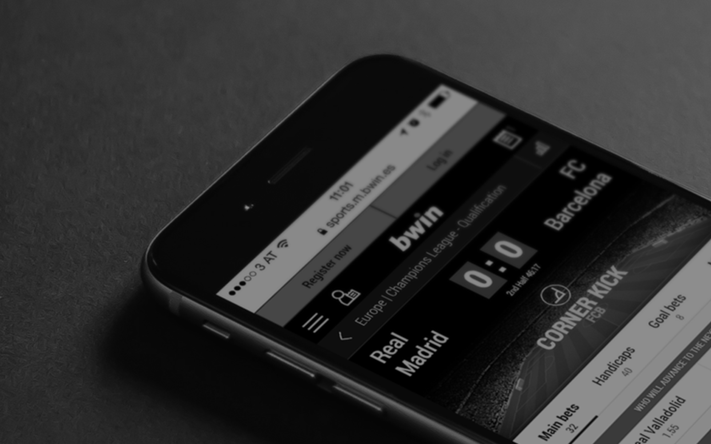
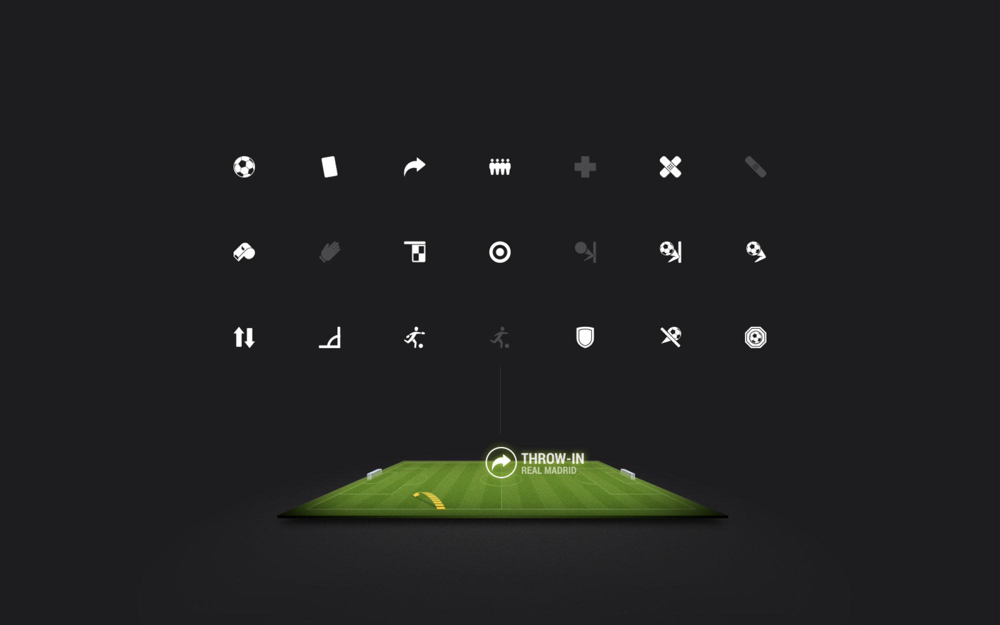
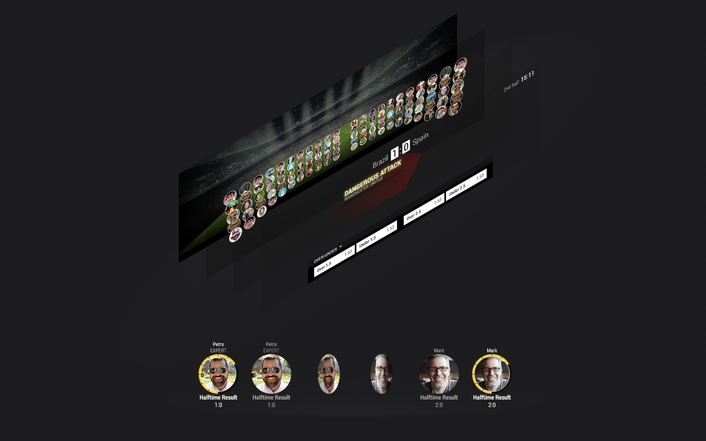

Redesign of the web and mobile platform is a project that focuses on improving the user experience and visual design of the website and mobile application. 

The redesign includes a new visual design with a clean and modern look and feel, new iconography that makes the navigation more intuitive, animations that enhance the overall user experience and make the platform more engaging. 

The goal of this redesign is to make the Bwin platform more user-friendly, visually appealing and easy to navigate for the users, in order to increase engagement and satisfaction.

