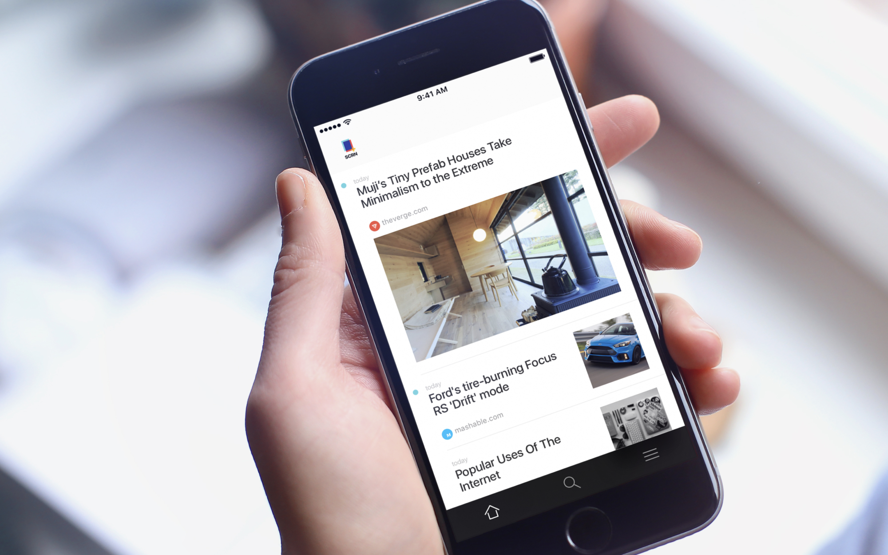
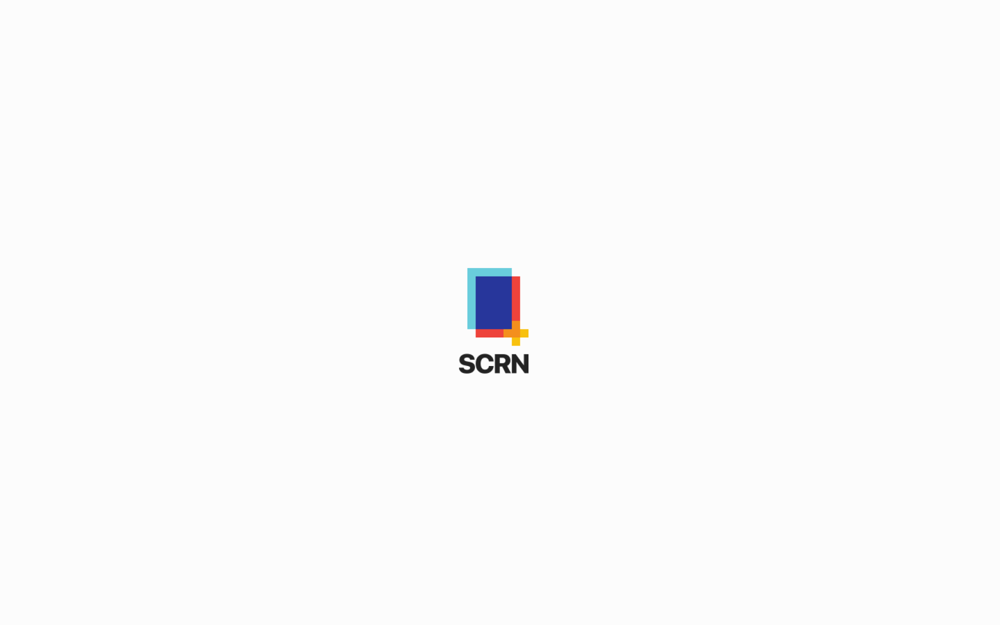
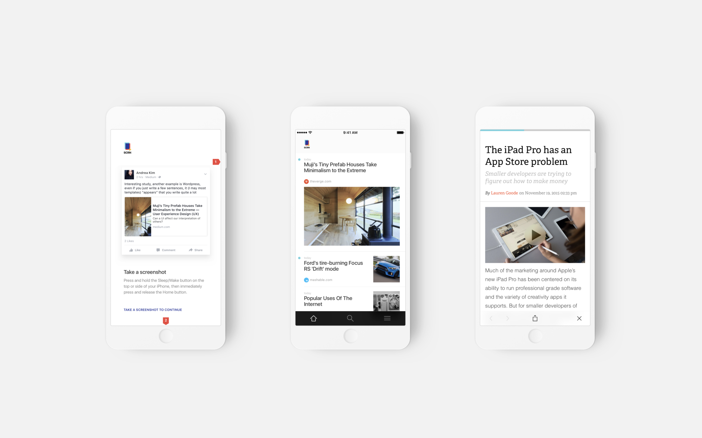
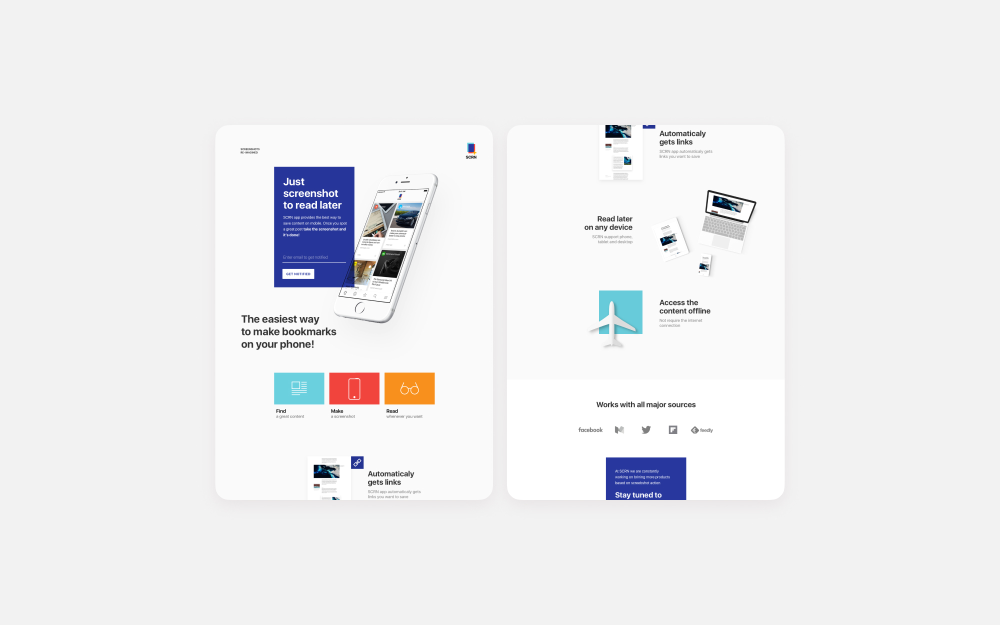
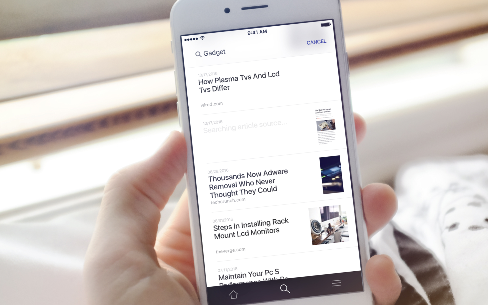

SCRN is an application that allows you to save notes from screenshots and read them later. 

With SCRN, you can capture screenshots of important information and add notes to them, such as a to-do list or meeting notes. The app also allows you to follow links that may be present in the screenshot, making it easy to access related content or websites. 

Additionally, SCRN's user-friendly interface allows you to organize and search through your notes, making it easy to find the information you need.

