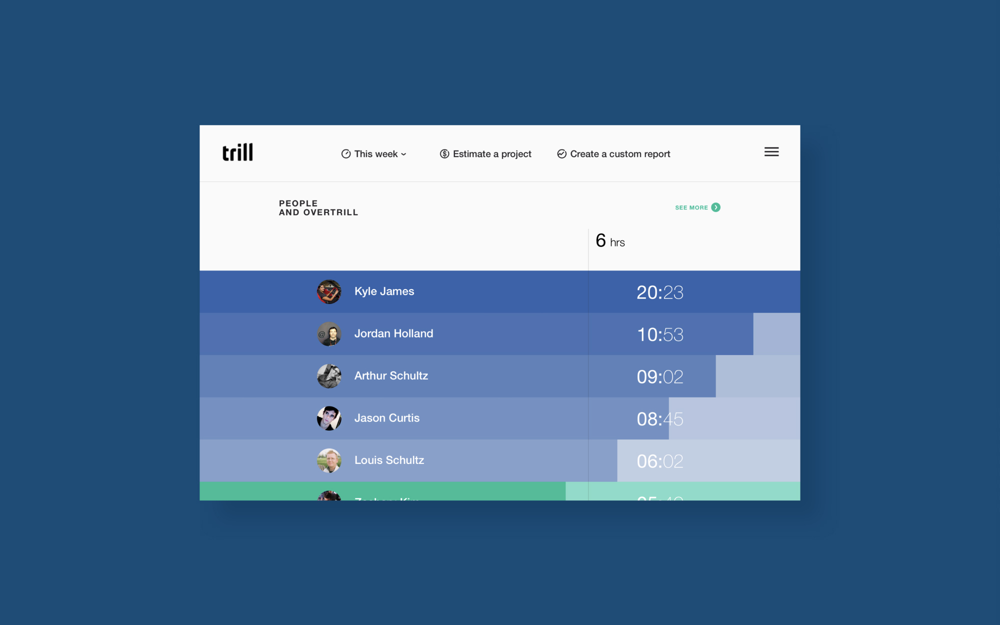
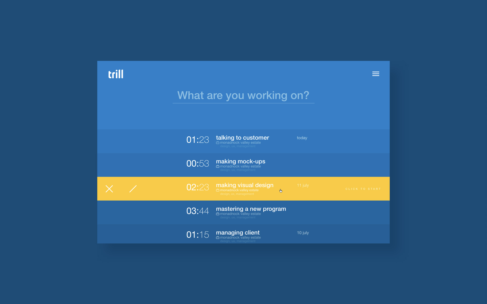

Trill is a platform designed for efficient time management in the workplace. It allows users to accurately track their work time and create detailed reports of their activity. Additionally, Trill provides tools for project estimates, giving users the ability to better plan and budget their work. Users can also create custom reports to fit their specific needs. Trill is a powerful tool that can help increase productivity and streamline workflows.

